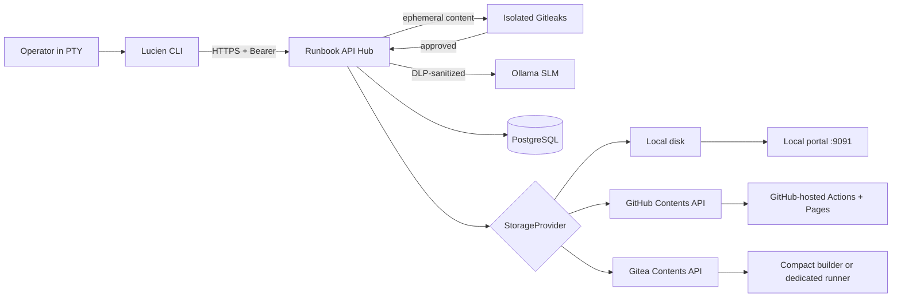

<p align="center">
  
</p>

<p align="center">
  <a href="README.md">Português (Brasil)</a> · <strong>English</strong>
</p>

<p align="center">
  
  
  
  
</p>

# Lucien Runbook Ecosystem

An executable foundation comprising a FastAPI Hub and a Go CLI that records
terminal sessions, extracts commands with a local SLM, supports playbook review,
and publishes them idempotently.

## Directory architecture

```text
lucien-runbook/
├── docker-compose.yml
├── deploy/install-hub.sh         # Hub and isolated runner/SSH modes
├── deploy/install-cli.sh         # native installation and public Linux CLI configuration
├── deploy/systemd/               # hardened Gitea act_runner unit
├── runbook-viewer/               # authenticated local portal and review through the Hub
├── wiki-builder/                 # fixed builder for compact Gitea mode
├── logo-lucien.png               # visual identity embedded in the local portal
├── mkdocs.yml
├── requirements-docs.txt
├── docs/                         # wiki source and published runbooks
├── deploy/nginx/                 # Nginx for compact Gitea/runner modes
├── .github/workflows/deploy.yml  # GitHub Actions + GitHub Pages
├── .gitea/workflows/deploy.yml   # Gitea Actions + Nginx through SSH/rsync
├── .env.example                  # consolidated mode
├── .env.server.example           # distributed Hub node
├── .env.client.example           # distributed CLI node
├── certgen/
│   ├── Dockerfile
│   └── generate-certs.sh         # CA and TLS certificate with SAN
├── backend/
│   ├── Dockerfile
│   ├── pyproject.toml
│   ├── migrations/               # versioned IAM schema transitions
│   ├── app/
│   │   ├── api/                  # FastAPI schemas and endpoints
│   │   ├── domain/               # entities, ports, and RBAC policy
│   │   ├── infrastructure/       # PostgreSQL, TLS/Bearer, Ollama, and strategies
│   │   ├── application.py        # use cases
│   │   └── main.py               # composition root
│   └── tests/
└── cli/
    ├── Dockerfile
    ├── go.mod / go.sum
    ├── cmd/                       # Cobra commands
    └── internal/
        ├── api/                   # HTTPS client
        ├── config/                # profile with 0600 permissions
        ├── draft/                 # draft shared between processes
        ├── editor/                # secure $EDITOR workflow
        └── recording/             # PTY, state, and ANSI sanitization
```



## Three publication modes

| Backend | Markdown destination | Reading method |
| --- | --- | --- |
| Local | immutable volume on the Hub host | authenticated HTTPS portal on port 9091 |
| GitHub | Contents API under `docs/runbooks/<year>/<area>` | GitHub Pages through Actions |
| Gitea | Contents API using the same layout | compact builder on the Hub or a dedicated Actions runner |

The Hub remains the authority for identity, RBAC, sanitization, and publication
in all three modes. Detailed configuration is available in
[Wiki publication](docs/publicacao.md), and the tutorial contains the `.env`
blocks for [each backend](docs/tutorial.md#escolher-o-destino).

### Local page example


See also a
[demonstration runbook published on GitHub](https://github.com/ValdemirBSJr/lucien-pub-runbook-example/blob/main/docs/runbooks/2026/redes/verificar-dns--11111111-1111-4111-8111-111111111111.md),
containing fictional data only.

## Security decisions

- Uvicorn terminates TLS directly and ignores `X-Forwarded-Proto`; the CLI
  rejects non-HTTPS URLs and requires the CA configured through `TLS_CA_FILE`.
- Every user receives an individual token. The Hub stores only its HMAC-SHA-256,
  using an `AUTH_PEPPER` kept outside the database. Every Job query includes
  `owner_id`.
- Middleware builds the `SecurityContext` exclusively from the token and
  database. The CLI does not define roles or functions. Revoked tokens fail on
  the next request.
- The bootstrap key creates only the first administrator and is disabled by
  default. Enable `USER_CREATION_ENABLED` for a short window, create the
  administrator from a controlled host, never distribute
  `LUCIEN_BOOTSTRAP_KEY`, and disable it again. A transactional PostgreSQL
  latch prevents two initial administrators even with multiple workers or
  replicas.
- The token is stored in Credential Manager, Keychain, or Secret Service. File
  fallback requires `LUCIEN_ALLOW_FILE_TOKEN=true`, Unix, and mode 0600; it is
  used by the minimal container.
- The API rejects client-provided frontmatter and generates author, level,
  function, date, and tags on the server. The SLM only labels content; RBAC
  decisions use deterministic rules.
- The Hub does not persist raw logs. Isolated Gitleaks blocks the log,
  description, SLM output, and final Markdown when it detects a secret;
  unavailability also blocks processing. DLP replaces residual patterns with
  placeholders before the SLM, after its response, and before publication; SLM
  output is never executed.
- The CA private key is not mounted in the Hub. The Hub receives only its
  certificate and `server.key`; the CLI receives only `ca.crt`. Application
  processes use UID 10001, a read-only filesystem, `cap_drop: ALL`, and
  `no-new-privileges`.
- Published Jobs are immutable. `DELETE` purges `PENDING` or `FAILED` Jobs;
  `force=true` can also cancel an owned `PROCESSING` Job. No option deletes
  the record of a published document, because that would break the audit trail
  without deleting the artifact.
- The portal mounts `playbooks-data` as read-only. An `admin` can review any
  local runbook, while a `senior` can review only runbooks in their own domain;
  the change returns to the Hub and creates a new immutable revision without
  overwriting the previous file.

`.env` configures `API_HOST` and other non-sensitive options. The installer
writes credentials as individual mode-0444 files under a mode-0700 `secrets/`
directory, mounted at `/run/secrets`; values do not appear in
`docker inspect`. This does not protect against root or access to the Docker
socket, so Vault/KMS remains appropriate when the host is outside the same trust
domain. Never commit `.env`, `secrets/`, private certificates, profiles, or
drafts.

## Consolidated startup

On the Linux host, the guided shortcut creates a restricted `.env` and an
editable Compose copy. It automatically generates certificates when they are
missing, reuses a complete set, and asks for confirmation only before starting
the Hub. The package must contain `docker-compose.yml`,
`docker-compose.build.yml`, `.dockerignore`, `backend/`, `certgen/`,
`secret-scanner/`, `certs/`, and `deploy/`; the root Compose file is the
template copied to `docker-compose.local.yml`:

```sh
chmod +x deploy/install-hub.sh
./deploy/install-hub.sh
```

After copying a new project version into an existing installation, update the
operational Compose copy without changing `.env`, `secrets/`, or the
certificates:

```bash
./deploy/install-hub.sh --refresh-compose
```

The previous Compose file is preserved as a backup when differences exist.

The dialog offers four presets: local disk with portal, GitHub Pages, compact
Gitea, and advanced Gitea runner. Only the last option displays commands that
must be executed separately on the dedicated runner host and the administrative
host:

```sh
./deploy/install-hub.sh --configure-gitea-runner
./deploy/install-hub.sh --prepare-nginx-deploy
```

Compact mode runs on the Hub host without a Docker socket and never executes
workflows or MkDocs configuration from the repository. Runner mode detects
`root`/`sudo` and must never run on the Hub, SLM, database, or Gitea host.
SSH mode refuses to write the private key inside the repository.

For the manual procedure or an API-only deployment, see
[docs/implantacao-isolada.md](docs/implantacao-isolada.md).

```powershell
Copy-Item .env.example .env
docker compose -f docker-compose.yml -f docker-compose.build.yml `
  --profile tools build certgen
docker compose --profile tools run --rm certgen
docker compose -f docker-compose.yml -f docker-compose.build.yml `
  --profile consolidated build
docker compose --profile consolidated up -d
docker compose --profile consolidated logs -f slm-init
```

The CLI runs natively in the operator terminal on Linux or macOS. On Linux, use
the separate installer, which detects the correct package, installs only the
Hub's public CA, and persists `API_HOST`, `TLS_CA_FILE`, and `EDITOR`:

### Download CLI 1.1.7

Official binaries are published on the
[Lucien Releases page](https://github.com/ValdemirBSJr/lucien/releases), never
in Git history. Release `v1.1.7` provides Linux and macOS packages for `amd64`
and `arm64`, together with SHA-256 checksums, `LICENSE`, `NOTICE`, and
third-party license notices.

On Linux, download the correct package and its `.sha256` file into `dist/`: use
`linux_amd64` on `x86_64` hosts and `linux_arm64` on `aarch64`/`arm64` hosts.
Then run
[`deploy/install-cli.sh`](https://github.com/ValdemirBSJr/lucien/blob/main/deploy/install-cli.sh)
from the project copy. The installer supports Linux only; Darwin packages are
provided for manual installation on macOS.

```sh
VERSION=1.1.7
ARCH=amd64
BASE_URL="https://github.com/ValdemirBSJr/lucien/releases/download/v${VERSION}"
mkdir -p dist
curl --fail --location --output "dist/lucien_${VERSION}_linux_${ARCH}.tar.gz" \
  "${BASE_URL}/lucien_${VERSION}_linux_${ARCH}.tar.gz"
curl --fail --location --output "dist/lucien_${VERSION}_linux_${ARCH}.tar.gz.sha256" \
  "${BASE_URL}/lucien_${VERSION}_linux_${ARCH}.tar.gz.sha256"
(cd dist && sha256sum -c "lucien_${VERSION}_linux_${ARCH}.tar.gz.sha256")
```

The installer does not compile the source: it validates and installs the
prebuilt package found under `dist/`:

```sh
chmod +x deploy/install-cli.sh
./deploy/install-cli.sh
```

The script can run `lucien create user operator` at the end. It does not create
a CA and does not persist the bootstrap key: `certs/ca.crt` must come from the
Hub. `LUCIEN_BOOTSTRAP_KEY` must be injected only during this controlled
execution, never into the CLI's permanent environment. The installer also
configures completion for Bash, Zsh, or Fish; Cobra's generator remains hidden
from the public menu. Docker is reserved for the Hub and its supporting
services; there is no `lucien` service in the production Compose file.

After registration, set `USER_CREATION_ENABLED=false` and recreate only the
Hub.

The administrator creates other users through `POST /admin/users`. The Hub
displays a one-time provisional credential valid for four hours; on the client,
use the no-echo prompt:

```powershell
lucien login
```

The CLI rejects a token passed as an argument to prevent exposure in shell
history or the process list. The provisional credential is atomically exchanged
for a permanent one. The local profile stores only ID, username, and the
credential backend identifier — never role or function.

The CLI keeps local state between processes in the user's profile:

```powershell
# Terminal 1: the description is optional, but recommended to guide the SLM.
lucien start provision-linux -d "Update packages and validate services"

# Terminal 2: stop the PTY and preserve the local session.
lucien stop

# Send the stopped session; this can be repeated after a network failure.
lucien upload
lucien job status <id_or_name_or_index>

# Show PROCESSING, PENDING, and FAILED Jobs for the authenticated user.
lucien reviews
lucien job <id_or_name_or_index>
lucien job sent <id_or_name_or_index>
lucien job del <id_or_name_or_index>
# If processing ends in FAILED after fixing the dependency:
lucien job retry <id_or_name_or_index>
```

If the shell exits naturally, run `stop` to consolidate local state and then
`upload`. Shutdown does not depend on the Hub or login. A network failure
preserves the log and state; repeat only `upload`.

`-d`/`--describe` accepts up to 280 characters. The Hub normalizes and
sanitizes this text before providing it to the SLM as untrusted context; it does
not grant privileges, does not change the `SecurityContext`, and does not enter
the Job or runbook. During processing, it remains encrypted only in the
transient queue.

## Distributed deployment

For an existing Gitea installation with the SLM on the same host as the Hub, use
the `consolidated` profile, `SLM_BASE_URL=http://slm:11434`, and
`STORAGE_PROVIDER=gitea`. The `server` profile below is only the alternative
where the SLM is remote.

On the server, copy `.env.server.example` to `.env`, generate a certificate
that includes the real FQDN in `CERT_DNS`, and run:

```powershell
docker compose --profile tools run --rm certgen
docker compose -f docker-compose.yml -f docker-compose.build.yml `
  --profile server build
docker compose --profile server up -d
```

On the Linux/macOS client, install the native binary and only `ca.crt`. Inject
`API_HOST` and `TLS_CA_FILE` into the process environment and run:

```sh
lucien reviews
```

The firewall must allow client → Hub/TCP 8443. PostgreSQL and Ollama remain on a
private network; do not expose ports 5432 or 11434. The certificate must contain
the exact hostname used by `API_HOST`.

## MkDocs and publication

To preview or validate the wiki locally:

```powershell
python -m venv .venv-docs
.\.venv-docs\Scripts\python -m pip install -r requirements-docs.txt
.\.venv-docs\Scripts\python -m mkdocs serve
```

The four modes coexist. Local disk uses the authenticated portal on port 9091
without a pipeline. GitHub uses `.github/workflows/deploy.yml`, the
sanitization hook pinned in `mkdocs.yml`, hosted runners, and the official
Pages artifact flow without `gh-pages`. Compact Gitea uses a fixed builder and
Nginx on the Hub host without a Docker socket. Only advanced mode reads
`.gitea/workflows/deploy.yml` and uses a dedicated VM for SSH/rsync, a host key
pinned in `WIKI_KNOWN_HOSTS`, and atomic release promotion.

On GitHub, select **Settings → Pages → Source → GitHub Actions**. In compact
Gitea mode, do not enable Actions. For the Gitea runner, enable Actions, use a
dedicated VM with Python, OpenSSH, and rsync, and register the secrets described
in [docs/publicacao.md](docs/publicacao.md).

On GitHub.com, the workflow works with private repositories on GitHub Pro, Team,
and Enterprise Cloud plans, but that does not make the site private. Private
Pages access requires a project repository owned by an organization on GitHub
Enterprise Cloud and **Private** visibility configured in Pages. Without that
condition, treat the URL as public and do not publish internal runbooks. This
workflow uses `actions/deploy-pages@v5` and does not support GitHub Enterprise
Server.

Protect `main` and require a pull request with one approval. There is a
deliberately documented incompatibility: the current `GitContentProvider`
writes directly to `GIT_BRANCH` through the Contents API. To preserve human
approval, the next evolution must create a branch and pull request and finalize
the Job only after the merge; a bypass for the service token weakens that
guarantee and must be exceptional and audited.

## Publication idempotency

`lucien job sent` calculates a deterministic key using the user, canonical Job
UUID, and Markdown SHA-256. The Hub reserves the
`Idempotency-Key` + content-hash pair in PostgreSQL using a row lock:

1. same Job, key, and content: return the previous result;
2. same key with different content: `409 Conflict`, including in `PENDING`;
3. Job still `PENDING`, different content, and a new key: the attempt replaces
   the previous reservation — a transient storage failure does not pin content;
4. `PUBLISHED` Job with different content: `409 Conflict`; publication is
   immutable;
5. timeout after Git accepts the `PUT`: retry reads the deterministic path
   `docs/runbooks/<year>/<domain>/<name>--<job_id>.md`; identical content is
   treated as success. The domain comes from the identity frozen by the Hub;
6. on local disk, the temporary file goes through `fsync` and is published
   through an atomic hard link without overwriting concurrent content.

This mechanism closes the “published externally, crashed before commit” window.
For multiple workers and high volume, the correct next step is a Transactional
Outbox plus queue, retaining a publication and reconciliation worker. Do not
wrap a Git call in a long-running transaction.

## Bottlenecks and honest limitations

- `POST /upload` returns `202` after sanitizing, encrypting, and queuing in
  PostgreSQL. The `upload-worker` processes the SLM with leases, retries, and
  backoff; `lucien job status` follows `PROCESSING`, `PENDING`, or
  `FAILED`.
- The actual output of each command is sanitized and limited to the first five
  lines, `...`, and the final line. SLM-generated objective, architecture,
  impact, and rollback are only suggestions marked for mandatory review; Lucien
  and the SLM never execute commands.
- Full uploads cannot resume by chunk. On unreliable links, add compression, a
  payload hash, and a multipart upload protocol; the current default limit is
  2 MiB.
- GitHub and Gitea impose rate limits and latency. Reuse connections and add
  retry with jitter and a circuit breaker when throughput justifies it; blind
  retries without reconciliation are incorrect.
- `LocalProvider` does not support multiple replicas without a coordinated RWX
  volume. For high availability, use Git, S3-compatible object storage, or a
  distributed filesystem and external PostgreSQL.
- `Base.metadata.create_all()` simplifies new installations, but it is not
  adequate for ongoing production schema management. Only when updating an
  installation that predates IAM, run, in order,
  `backend/migrations/001_iam_rbac_postgresql.sql`,
  `backend/migrations/002_bootstrap_state_postgresql.sql`,
  `backend/migrations/003_runbook_revisions_postgresql.sql`,
  `backend/migrations/004_provisional_tokens_postgresql.sql`, and
  `backend/migrations/005_async_upload_queue_postgresql.sql`. Do not run
  `001` on an empty database: it renames columns from the legacy schema.
  Migration `003` locks the `jobs` table during the alteration; run it in a
  maintenance window. Before the next revision, add Alembic and run migrations
  in a single deployment Job.
- A static API key does not provide short expiration. The recommended evolution
  is short-lived M2M JWT issued by an IdP, key rotation/revocation, and, for
  greater assurance, mTLS between the CLI and Hub.
- Gitleaks detects known patterns and entropy, and DLP redacts known formats.
  Neither replaces corporate classification, human review, or custom rules for
  proprietary secrets; add them to the scanner configuration before claiming
  regulatory coverage.

## Verification

```powershell
docker compose --env-file .env.example config --quiet
docker compose --env-file .env.example -f docker-compose.yml `
  -f docker-compose.build.yml --profile tools build hub certgen
docker build --target test -t lucien-hub-test backend
docker run --rm lucien-hub-test

python -m pip install -r requirements-docs.txt
python -m mkdocs build --strict

Set-Location cli
go test ./...
```

## License

Lucien is distributed under the Apache License 2.0. See [LICENSE](LICENSE),
[NOTICE](NOTICE), and the [CLI dependency notices](THIRD-PARTY-NOTICES.txt).
Copyright 2026 Valdemir Bezerra de Souza Jr.

## Official website

Learn more at [lucien.unotroop.com.br](https://lucien.unotroop.com.br).
