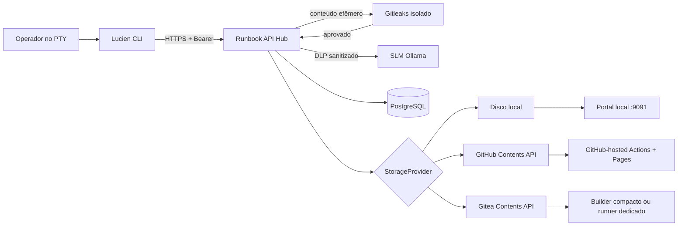
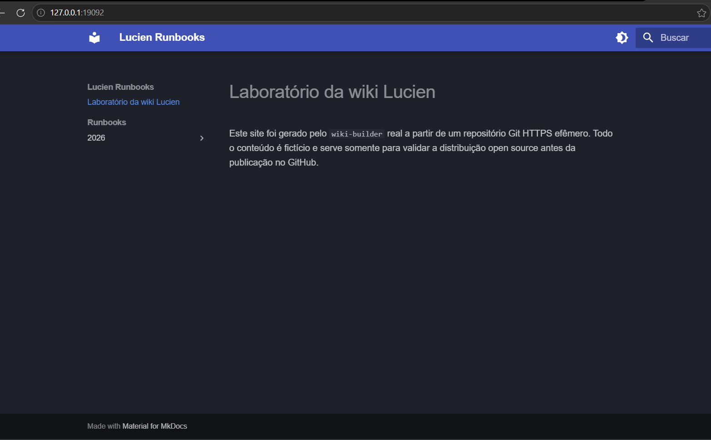
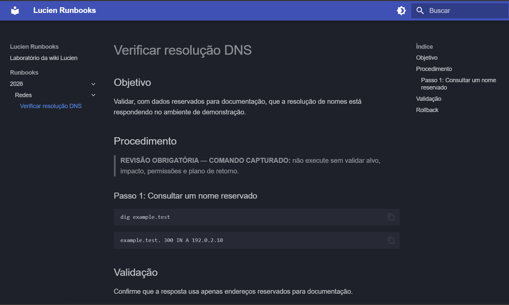

<p align="center">
  
</p>

<p align="center">
  <strong>Português (Brasil)</strong> · <a href="README.en.md">English</a>
</p>

<p align="center">
  
  
  
  
</p>

# Lucien Runbook Ecosystem

Fundação executável de um Hub FastAPI e um CLI Go para gravar sessões de terminal,
extrair comandos com SLM local, revisar playbooks e publicá-los de modo idempotente.

## Arquitetura de diretórios

```text
lucien-runbook/
├── docker-compose.yml
├── deploy/install-hub.sh         # Hub e modos isolados do runner/SSH
├── deploy/install-cli.sh         # instalação nativa e configuração pública do CLI Linux
├── deploy/systemd/               # unidade endurecida do Gitea act_runner
├── runbook-viewer/               # portal local autenticado e revisão via Hub
├── wiki-builder/                 # builder fixo do modo Gitea compacto
├── logo-lucien.png               # identidade visual incorporada ao portal local
├── mkdocs.yml
├── requirements-docs.txt
├── docs/                        # fonte da wiki e runbooks publicados
├── deploy/nginx/                # Nginx dos modos Gitea compacto/runner
├── .github/workflows/deploy.yml # GitHub Actions + GitHub Pages
├── .gitea/workflows/deploy.yml  # Gitea Actions + Nginx via SSH/rsync
├── .env.example                 # modo consolidado
├── .env.server.example          # nó do Hub distribuído
├── .env.client.example          # nó do CLI distribuído
├── certgen/
│   ├── Dockerfile
│   └── generate-certs.sh        # CA e certificado TLS com SAN
├── backend/
│   ├── Dockerfile
│   ├── pyproject.toml
│   ├── migrations/              # transição versionada do schema IAM
│   ├── app/
│   │   ├── api/                 # schemas e endpoints FastAPI
│   │   ├── domain/              # entidades, portas e política RBAC
│   │   ├── infrastructure/      # PostgreSQL, TLS/Bearer, Ollama e Strategies
│   │   ├── application.py       # casos de uso
│   │   └── main.py              # composition root
│   └── tests/
└── cli/
    ├── Dockerfile
    ├── go.mod / go.sum
    ├── cmd/                     # comandos Cobra
    └── internal/
        ├── api/                 # cliente HTTPS
        ├── config/              # perfil com permissão 0600
        ├── draft/               # rascunho entre processos
        ├── editor/              # fluxo seguro do $EDITOR
        └── recording/           # PTY, estado e sanitização ANSI
```



## Três formas de publicação

| Backend | Destino do Markdown | Forma de leitura |
| --- | --- | --- |
| Local | volume imutável no host do Hub | portal autenticado em HTTPS/9091 |
| GitHub | Contents API, em `docs/runbooks/<ano>/<área>` | GitHub Pages por Actions |
| Gitea | Contents API, no mesmo layout | builder compacto no Hub ou Actions runner dedicado |

O Hub continua sendo a autoridade de identidade, RBAC, sanitização e publicação
nos três modos. A configuração detalhada está em
[Publicação da wiki](docs/publicacao.md); o tutorial contém os blocos `.env` de
[cada backend](docs/tutorial.md#escolher-o-destino).

### Exemplo da página local





Veja também um
[runbook de demonstração publicado no GitHub](https://github.com/ValdemirBSJr/lucien-pub-runbook-example/blob/main/docs/runbooks/2026/redes/verificar-dns--11111111-1111-4111-8111-111111111111.md),
com dados exclusivamente fictícios.

## Decisões de segurança

- O Uvicorn termina TLS diretamente e ignora `X-Forwarded-Proto`; o CLI rejeita URL
  que não seja HTTPS e exige a CA configurada em `TLS_CA_FILE`.
- Cada usuário recebe um token próprio. O Hub grava somente HMAC-SHA-256 do token,
  com `AUTH_PEPPER` fora do banco. Toda consulta de Job inclui `owner_id`.
- O middleware cria o `SecurityContext` exclusivamente a partir do token e do banco.
  O CLI não define papel nem função. Tokens revogados falham na requisição seguinte.
- A chave de bootstrap cria somente o primeiro admin e vem desabilitada por padrão.
  Habilite `USER_CREATION_ENABLED` por uma janela curta, crie o admin a partir de
  um host controlado, nunca distribua `LUCIEN_BOOTSTRAP_KEY` e desabilite novamente.
  Um latch transacional no PostgreSQL impede dois primeiros admins mesmo com
  múltiplos workers ou réplicas.
- O token fica no Credential Manager/Keychain/Secret Service. O fallback em arquivo
  exige `LUCIEN_ALLOW_FILE_TOKEN=true`, Unix e modo 0600; é usado no contêiner mínimo.
- A API rejeita frontmatter do cliente e gera autor, nível, função, data e tags no
  servidor. A SLM só etiqueta; decisões RBAC usam regras determinísticas.
- O log bruto não é persistido no Hub. O Gitleaks isolado bloqueia log, descrição,
  saída da SLM e Markdown final ao detectar segredo; a indisponibilidade também
  bloqueia. A DLP substitui padrões residuais por placeholders antes da SLM, após
  sua resposta e antes da publicação; a saída da SLM nunca é executada.
- A chave privada da CA não é montada no Hub. O Hub recebe apenas seu certificado e
  `server.key`; o CLI recebe apenas `ca.crt`. Processos de aplicação usam UID 10001,
  filesystem read-only, `cap_drop: ALL` e `no-new-privileges`.
- Jobs publicados são imutáveis. `DELETE` expurga Jobs `PENDING` ou `FAILED`;
  `force=true` também cancela um `PROCESSING` próprio. Nenhuma opção apaga o
  registro de um documento publicado, pois isso quebraria a auditoria sem apagar
  o artefato.
- O portal mantém `playbooks-data` como somente leitura. `admin` pode revisar
  qualquer runbook local e `senior` apenas os do próprio domínio; a alteração
  volta ao Hub e cria uma nova revisão imutável, sem sobrescrever o arquivo anterior.

`.env` parametriza `API_HOST` e demais opções não sensíveis. O instalador grava
credenciais em arquivos `0444` sob um diretório `secrets/` com modo `0700`,
montados em `/run/secrets`; os
valores não aparecem no `docker inspect`. Isso não protege contra root ou acesso
ao socket Docker, portanto Vault/KMS continua indicado quando o host não pertence
ao mesmo domínio de confiança. Nunca versione `.env`, `secrets/`, certificados
privados, perfis ou rascunhos.

## Inicialização consolidada

No host Linux, o atalho guiado cria um `.env` restrito e uma cópia editável do
Compose. Ele gera os certificados automaticamente quando estão ausentes,
reutiliza um conjunto completo e pede confirmação apenas para iniciar o Hub. O
pacote precisa conter `docker-compose.yml`, `docker-compose.build.yml`,
`.dockerignore`, `backend/`, `certgen/`,
`secret-scanner/`, `certs/` e `deploy/`; o Compose raiz é o modelo que será
copiado para `docker-compose.local.yml`:

```sh
chmod +x deploy/install-hub.sh
./deploy/install-hub.sh
```

Em uma instalação existente, depois de copiar uma versão nova do projeto,
atualize a cópia operacional do Compose sem tocar no `.env`, em `secrets/` ou
nos certificados:

```bash
./deploy/install-hub.sh --refresh-compose
```

O Compose anterior é preservado como backup quando houver diferenças.

O diálogo oferece quatro presets: disco local com portal, GitHub Pages, Gitea
compacto e Gitea runner avançado. Somente a última opção apresenta comandos que
devem ser executados separadamente no host dedicado do runner e no host
administrativo:

```sh
./deploy/install-hub.sh --configure-gitea-runner
./deploy/install-hub.sh --prepare-nginx-deploy
```

O modo compacto roda no host do Hub sem socket Docker e nunca executa workflows
ou configuração MkDocs vindos do repositório. O modo do runner detecta
`root`/`sudo` e nunca deve ser executado no host do Hub, SLM, banco ou Gitea. O
modo SSH recusa gravar a chave privada dentro do repositório.

Para o procedimento manual ou implantação apenas da API, consulte
[docs/implantacao-isolada.md](docs/implantacao-isolada.md).

```bash
cp .env.example .env
docker compose -f docker-compose.yml -f docker-compose.build.yml \
  --profile tools build certgen
docker compose --profile tools run --rm certgen
docker compose -f docker-compose.yml -f docker-compose.build.yml \
  --profile consolidated build
docker compose --profile consolidated up -d
docker compose --profile consolidated logs -f slm-init
```

O CLI é nativo no terminal do operador (Linux/macOS). No Linux, use o instalador
separado, que detecta o pacote correto, instala somente a CA pública do Hub e
persiste `API_HOST`, `TLS_CA_FILE` e `EDITOR`:

### Baixar o CLI 1.1.9

Os binários oficiais ficam na página de
[Releases do Lucien](https://github.com/ValdemirBSJr/lucien/releases), nunca no
histórico Git. A release `v1.1.9` oferece pacotes para Linux e macOS nas
arquiteturas `amd64` e `arm64`, acompanhados por checksums SHA-256, `LICENSE`,
`NOTICE` e avisos de licenças de terceiros.

No Linux, baixe o pacote correto e seu `.sha256` para `dist/`: use
`linux_amd64` em hosts `x86_64` e `linux_arm64` em hosts `aarch64`/`arm64`.
Depois execute o
[`deploy/install-cli.sh`](https://github.com/ValdemirBSJr/lucien/blob/main/deploy/install-cli.sh)
da cópia do projeto. O instalador suporta somente Linux; os pacotes Darwin são
destinados à instalação manual no macOS.

```sh
VERSION=1.1.9
ARCH=amd64
BASE_URL="https://github.com/ValdemirBSJr/lucien/releases/download/v${VERSION}"
mkdir -p dist
curl --fail --location --output "dist/lucien_${VERSION}_linux_${ARCH}.tar.gz" \
  "${BASE_URL}/lucien_${VERSION}_linux_${ARCH}.tar.gz"
curl --fail --location --output "dist/lucien_${VERSION}_linux_${ARCH}.tar.gz.sha256" \
  "${BASE_URL}/lucien_${VERSION}_linux_${ARCH}.tar.gz.sha256"
(cd dist && sha256sum -c "lucien_${VERSION}_linux_${ARCH}.tar.gz.sha256")
```

O instalador não compila o código: ele valida e instala o pacote já construído
que está em `dist/`:

```sh
chmod +x deploy/install-cli.sh
./deploy/install-cli.sh
```

O script pode executar `lucien create user operador` ao final. Ele não cria CA e
não persiste a chave de bootstrap: `certs/ca.crt` deve vir do Hub.
A `LUCIEN_BOOTSTRAP_KEY` deve ser injetada somente nessa execução controlada, nunca
no ambiente permanente do CLI. O instalador também configura o autocompletar para
Bash, Zsh ou Fish; o gerador do Cobra permanece oculto no menu público.
Docker é reservado ao Hub e seus serviços de apoio; não há serviço `lucien` no
Compose de produção.

Depois do cadastro, defina `USER_CREATION_ENABLED=false` e recrie somente o Hub.

O admin cria os demais usuários por `POST /admin/users`. O Hub exibe uma
credencial provisória de uso único, válida por quatro horas; no cliente use o
prompt sem eco:

```bash
lucien login
```

O CLI rejeita token como argumento para impedir exposição no histórico do shell
ou na lista de processos. A provisória é trocada atomicamente por uma permanente.
O perfil local guarda apenas ID, username e o identificador do backend de
credenciais — nunca papel ou função.

O CLI mantém estado local entre processos no perfil do usuário:

```bash
# Terminal 1: a descrição é opcional, mas recomendada para orientar a SLM.
lucien start provision-linux -d "Atualizar pacotes e validar serviços"

# Terminal 2: encerra o PTY e preserva a sessão local.
lucien stop

# Envia a sessão encerrada; pode ser repetido após falha de rede.
lucien upload
lucien job status <id_ou_nome_ou_indice>

# Exibe PROCESSING, PENDING e FAILED do usuário autenticado.
lucien reviews
lucien job <id_ou_nome_ou_indice>
lucien job sent <id_ou_nome_ou_indice>
lucien job del <id_ou_nome_ou_indice>
# Se o processamento terminar em FAILED após corrigir a dependência:
lucien job retry <id_ou_nome_ou_indice>
```

Se o shell terminar naturalmente, execute `stop` para consolidar o estado local e
depois `upload`. O encerramento não depende do Hub ou do login. Uma falha de rede
preserva log e estado; repita somente `upload`.

`-d`/`--describe` aceita até 280 caracteres. O Hub normaliza e sanitiza esse texto
antes de fornecê-lo à SLM como contexto não confiável; ele não concede privilégios,
não altera o `SecurityContext` e não entra no Job nem no runbook. Durante o
processamento, fica cifrado somente na fila transitória.

## Deployment distribuído

Para uma instalação Gitea já existente com SLM no mesmo host do Hub, use o perfil
`consolidated`, `SLM_BASE_URL=http://slm:11434` e `STORAGE_PROVIDER=gitea`. O
perfil `server` abaixo é apenas a alternativa em que a SLM fica remota.

No servidor, copie `.env.server.example` para `.env`, gere certificado incluindo o
FQDN real em `CERT_DNS` e execute:

```bash
docker compose --profile tools run --rm certgen
docker compose -f docker-compose.yml -f docker-compose.build.yml \
  --profile server build
docker compose --profile server up -d
```

No cliente Linux/macOS, instale o binário nativo e somente `ca.crt`. Injete
`API_HOST` e `TLS_CA_FILE` no ambiente do processo e execute:

```sh
lucien reviews
```

Firewall deve permitir cliente → Hub/TCP 8443. PostgreSQL e Ollama permanecem em rede
privada; não publique as portas 5432 ou 11434. O certificado precisa conter o hostname
exato usado por `API_HOST`.

## MkDocs e publicação

Para visualizar ou validar a wiki localmente:

```bash
python -m venv .venv-docs
.venv-docs/bin/python -m pip install -r requirements-docs.txt
.venv-docs/bin/python -m mkdocs serve
```

Os quatro modos coexistem. O disco local usa o portal autenticado na porta 9091,
sem pipeline. GitHub usa o workflow em `.github/workflows/deploy.yml`, o hook de
sanitização fixado no `mkdocs.yml` e runners hospedados + fluxo oficial de
artefato do Pages, sem `gh-pages`. Gitea compacto
usa um builder fixo e Nginx no host do Hub, sem Docker socket. Apenas o modo
avançado lê `.gitea/workflows/deploy.yml` e usa uma VM dedicada para SSH/rsync,
chave de host fixada em `WIKI_KNOWN_HOSTS` e promoção atômica de releases.

No GitHub, selecione **Settings → Pages → Source → GitHub Actions**. No modo Gitea
compacto, não habilite Actions. No Gitea runner, habilite Actions, use uma VM
dedicada com Python, OpenSSH e rsync e cadastre os segredos descritos em
[docs/publicacao.md](docs/publicacao.md).

No GitHub.com, o workflow funciona com repositório privado nos planos GitHub Pro,
Team e Enterprise Cloud, mas isso não torna o site privado. Acesso privado ao Pages exige um
repositório de projeto pertencente a uma organização no GitHub Enterprise Cloud
e a visibilidade **Private** configurada em Pages. Sem essa condição, trate a URL
como pública e não publique runbooks internos. Este workflow usa
`actions/deploy-pages@v5` e não suporta GitHub Enterprise Server.

Proteja `main` e exija Pull Request com uma aprovação. Há uma incompatibilidade
deliberadamente explicitada: o `GitContentProvider` atual escreve direto em
`GIT_BRANCH` pela API de Contents. Para preservar aprovação humana, a próxima
evolução deve criar branch + PR e só finalizar o Job após o merge; um bypass para
o token de serviço reduz essa garantia e precisa ser excepcional e auditado.

## Idempotência da publicação

`lucien job sent` calcula uma chave determinística com usuário, UUID canônico do Job e
SHA-256 do Markdown. O Hub reserva no PostgreSQL a dupla `Idempotency-Key` + hash do
conteúdo usando lock da linha:

1. mesmo Job, chave e conteúdo: retorna o resultado anterior;
2. mesma chave com conteúdo diferente: `409 Conflict`, inclusive em `PENDING`;
3. Job ainda `PENDING` com conteúdo diferente e chave nova: a tentativa substitui
   a reserva anterior — uma falha transitória do storage não prende o conteúdo;
4. Job `PUBLISHED` com conteúdo diferente: `409 Conflict`, publicação é imutável;
5. timeout após o Git aceitar o `PUT`: o retry consulta o caminho determinístico
   `docs/runbooks/<ano>/<domain>/<nome>--<job_id>.md`; conteúdo igual é tratado
   como sucesso. O domínio vem da identidade congelada pelo Hub;
6. no disco local, o arquivo temporário passa por `fsync` e é publicado por hard
   link atômico, sem sobrescrever conteúdo concorrente.

Esse mecanismo fecha a janela “publicou fora, caiu antes do commit”. Para múltiplos
workers e alto volume, o próximo passo correto é Transactional Outbox + fila, mantendo
um worker de publicação e reconciliação. Não envolva chamada Git em transação longa.

## Gargalos e limites honestos

- `POST /upload` retorna `202` após sanitizar, cifrar e enfileirar no PostgreSQL.
  O `upload-worker` processa a SLM com lease, retry e backoff; `lucien job status`
  acompanha `PROCESSING`, `PENDING` ou `FAILED`.
- A saída real de cada comando é sanitizada e limitada às cinco primeiras linhas,
  `...` e a última. Objetivo, arquitetura, impacto e rollback da SLM são apenas
  sugestões marcadas para revisão obrigatória; Lucien e SLM nunca executam comandos.
- Upload integral não retoma por chunks. Em links ruins, adicione compressão, hash do
  payload e protocolo de upload multipartes; hoje o limite padrão é 2 MiB.
- GitHub/Gitea impõem rate limit e latência. Reuse conexões, aplique retry com jitter e
  circuit breaker quando o throughput justificar; retries cegos sem reconciliação são
  incorretos.
- `LocalProvider` não serve para vários réplicas sem volume RWX coordenado. Para HA,
  use Git, objeto compatível com S3 ou filesystem distribuído e PostgreSQL externo.
- `Base.metadata.create_all()` facilita instalações novas, mas um sênior não
  aprovaria isso como gestão contínua de schema em produção. Somente ao atualizar
  uma instalação anterior ao IAM, execute, em ordem,
  `backend/migrations/001_iam_rbac_postgresql.sql`,
  `backend/migrations/002_bootstrap_state_postgresql.sql` e
  `backend/migrations/003_runbook_revisions_postgresql.sql`,
  `backend/migrations/004_provisional_tokens_postgresql.sql` e
  `backend/migrations/005_async_upload_queue_postgresql.sql`. Não aplique `001` em
  banco vazio: ela renomeia colunas do schema legado. A migração `003` bloqueia a
  tabela `jobs` durante a alteração; execute-a em uma janela de manutenção. Antes
  da próxima revisão, adicione Alembic e execute migrações em um Job único de
  deployment.
- API Key estática não oferece expiração curta. A evolução recomendada é JWT M2M de
  curta duração emitido por IdP, rotação/revogação de chaves e, para maior confiança,
  mTLS entre CLI e Hub.
- O Gitleaks detecta padrões e entropia conhecidos, e a DLP redige formatos
  conhecidos. Nenhum dos dois substitui classificação corporativa, revisão humana
  ou regras específicas para segredos proprietários; adicione-as à configuração
  do scanner antes de declarar cobertura regulatória.

## Verificação

```bash
docker compose --env-file .env.example config --quiet
docker compose --env-file .env.example -f docker-compose.yml \
  -f docker-compose.build.yml --profile tools build hub certgen
docker build --target test -t lucien-hub-test backend
docker run --rm lucien-hub-test

python -m pip install -r requirements-docs.txt
python -m mkdocs build --strict

cd cli
go test ./...
```

## Licença

Lucien é distribuído sob a Apache License 2.0. Consulte [LICENSE](LICENSE),
[NOTICE](NOTICE) e os [avisos das dependências do CLI](THIRD-PARTY-NOTICES.txt).
Copyright 2026 Valdemir Bezerra de Souza Jr.

## Site oficial

Saiba mais em [lucien.unotroop.com.br](https://lucien.unotroop.com.br).
