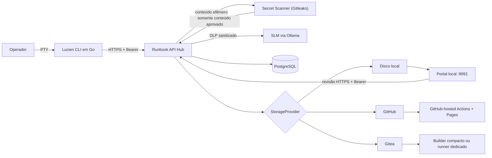
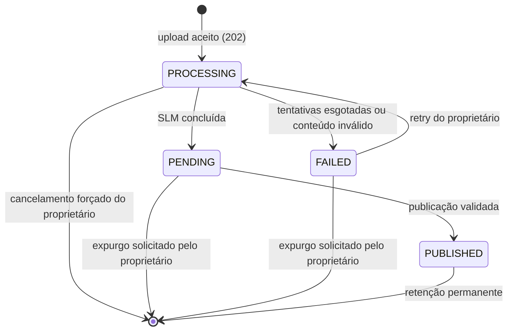

# Documentação técnica

## Finalidade

O Lucien transforma uma sessão de terminal em um runbook revisado e publicável.
O ecossistema separa captura, identidade, extração por SLM, revisão humana e
persistência para que nenhuma dessas etapas concentre autoridade excessiva.

Esta página é a referência técnica geral. Consulte também:

- [Tutorial de uso](tutorial.md) para executar o fluxo completo;
- [Implantação isolada e TLS](implantacao-isolada.md) para separar os nós e emitir
  certificados;
- [Operação e segurança](operacao.md) para a gramática dos runbooks;
- [IAM, RBAC e metadados](iam-rbac.md) para identidade e autorização;
- [Publicação da wiki](publicacao.md) para portal local, GitHub Pages ou Gitea.

## Arquitetura



| Componente | Responsabilidade | Não deve fazer |
| --- | --- | --- |
| Lucien CLI | gravar PTY, remover ANSI, revisar comandos e guardar token no cofre local | definir papel, função, tags confiáveis ou frontmatter |
| API Hub | autenticar, autorizar, sanitizar, controlar Jobs e publicar | confiar em identidade ou privilégio enviados pelo cliente |
| SLM | extrair comandos e sugerir tags | executar comandos ou tomar decisões de RBAC |
| Enriquecedor determinístico | derivar tags, pré-requisitos, impactos e rollback por tabela revisável | substituir a extração ou decidir autorização |
| PostgreSQL | persistir usuários, Jobs e reservas idempotentes | armazenar token em texto puro ou log bruto |
| StorageProvider | publicar o Markdown validado | alterar identidade ou política de autorização |
| Portal local | autenticar no Hub, renderizar o volume read-only e encaminhar revisões autorizadas | escrever no volume ou confiar no username/papel informado |
| MkDocs | compilar a documentação estática | receber segredos ou conteúdo não revisado |
| Builder compacto | compilar uma branch Gitea com configuração fixa | executar workflow, hook, plugin ou script do repositório |

## Fluxo de dados

1. `lucien start <nome> -d "descrição"` abre um PTY e grava o terminal localmente.
   O PTY recebe o tamanho do terminal de origem, ou 80x24 quando não há um, e
   acompanha `SIGWINCH`. Um PTY 0x0 seria propagado pelo cliente SSH ao
   equipamento remoto, que ficaria sem nada para renderizar — é o que fazia
   sessões SSH para OLT, CMTS e roteadores parecerem congeladas.
2. `lucien stop` encerra a captura e preserva estado e log localmente, sem depender
   de autenticação ou disponibilidade do Hub.
3. `lucien upload` remove escapes ANSI e envia a sessão encerrada. O Hub retorna
   `202 Accepted` com um Job `PROCESSING`; o CLI remove a cópia local somente
   depois desse aceite. Após perda da resposta, consulta o nome antes de repetir.
4. O Hub valida o token e envia log e descrição ao Secret Scanner isolado.
   Detecção ou indisponibilidade bloqueiam o processamento (*fail closed*).
5. A DLP sanitiza o conteúdo aprovado. O Hub cifra log e descrição com AES-GCM,
   vinculados a proprietário e nome, e grava uma fila durável no PostgreSQL.
6. Um worker adquire lease com `FOR UPDATE SKIP LOCKED`, consulta a SLM e verifica
   novamente sua saída. Para compensar omissões de modelos pequenos, linhas com prompt
   reconhecível complementam as sugestões da SLM. Somente comandos completos observados
   no log são aceitos; fragmentos, falhas `command not found` e comandos de controle da
   captura (`lucien start`, `stop` e `upload`) são descartados. O worker associa a cada
   comando sua saída sanitizada: mantém até as cinco primeiras linhas e, quando houver
   mais conteúdo, acrescenta `...` e a última linha. Na mesma chamada de enriquecimento,
   a SLM sugere tags, objetivo, arquitetura/pré-requisitos, possíveis impactos e rollback
   no idioma configurado. Essas sugestões são texto não autoritativo, limitado e passam
   novamente por Secret Scanner e DLP. O enriquecimento é auxiliar: `SLM_ENRICHMENT_ENABLED=false`
   pula a chamada e, mesmo habilitado, uma falha de upstream registra
   `job.enrichment_skipped` e preserva a extração em vez de derrubar o Job — o CLI
   emite a estrutura básica e o operador redige objetivo, validação e rollback na
   revisão obrigatória. Com `RUNBOOK_ENRICHER=deterministic`, o enriquecimento não usa
   modelo algum: tags, pré-requisitos, impactos e rollback saem de tabelas revisáveis
   em `app/infrastructure/enrichment.py`, aplicadas aos comandos já extraídos. Ele
   reaproveita a mesma classificação de risco da validação de publicação, cobre
   ferramentas Linux e plataformas de rede (CMTS DOCSIS, OLT GPON e roteadores de
   borda), afirma fabricante somente quando a sintaxe é distintiva e nunca inventa
   rollback — só inverte pares simétricos como `shutdown`/`no shutdown`.
   A descrição de `lucien start -d`, sanitizada, é persistida no
   Job e preenche o Objetivo quando não há sugestão da SLM, rotulada como texto do
   operador. Em sucesso, remove o payload e muda o Job para
   `PENDING`; falhas transitórias usam backoff e falhas finais mudam para `FAILED`.
   O prompt é reconhecido em duas gramáticas: a POSIX, que separa o comando por
   espaço (`user@host:~$ ls`), e a de equipamento de rede, que cola o comando no
   prompt (`OLT01>display board 0`, `Router#show run`). Sem a segunda, nenhuma
   sessão SSH a OLT, CMTS ou roteador de borda tinha comando extraído, e a
   whitelist caía no modo permissivo, aceitando linhas de saída como comando.
   Editores e paginadores de tela cheia -- `nano`, `vi`, `less` -- desenham a
   tela inteira em vez de produzir saída linear. O CLI colapsa a região da tela
   alternativa (`ESC[?1049h` até `ESC[?1049l`) numa linha que diz o que houve
   ali; sem isso o bloco de saída recebia a barra de menu do nano e as linhas
   de preenchimento do vi, na medição 652 e 1679 caracteres de ruído. A região
   só é colapsada quando não há nada dentro que pareça comando: sob `tmux` ou
   `screen` a sessão inteira roda na tela alternativa, e colapsar ali apagaria
   a captura toda. `more` não usa tela alternativa e continua entregando o
   conteúdo que apareceu, que ali é a saída de verdade.
7. `lucien job <id_ou_nome_ou_indice>` permite selecionar comandos e editar o
   Markdown. Desmarcar um comando remove também sua saída e seu impacto associado.
   Todo comando e toda sugestão recebem um aviso de revisão obrigatória antes do bloco;
   Lucien e SLM nunca executam esses comandos. O índice usa a mesma lista ordenada de
   `lucien reviews`.
8. `lucien job sent <id_ou_nome_ou_indice>` publica com uma chave de idempotência.
9. O Hub aplica RBAC, rejeita frontmatter do cliente, injeta metadados confiáveis
   e delega a gravação ao `StorageProvider` configurado.
10. `lucien runbook revise <uuid>` corrige uma publicação em qualquer provedor.
    No modo local, o portal oferece o mesmo fluxo pela web. O Hub cria um novo
    Job/artefato e preserva toda a linhagem. Diferente dos comandos de Job, aqui
    só o UUID exato é aceito: um índice errado publicaria sobre o runbook errado.

Em `## Objetivo`, a descrição de `lucien start -d` vira um subtítulo `###` —
é o assunto do runbook, e um título o torna reconhecível no índice da wiki e na
listagem do portal. A nota de revisão obrigatória vem logo abaixo, que é onde o
operador escreve o objetivo em si.

Por isso a gramática aceita um `###` que não seja cabeçalho de passo. A garantia
que importa continua intacta: um bloco ```bash só é aceito imediatamente após um
`### Passo N: Ação` bem-formado e sequencial. Um `###` livre seguido de bloco de
comando é recusado, então nenhum comando entra no runbook sem passar pela
numeração de passos.

O artefato publicado usa `<nome_limpo>--<uuid_completo>.md`. O nome limpo remove
somente o sufixo de sessão gerado pelo CLI; o UUID confiável continua no
frontmatter e o provider recusa qualquer sobrescrita divergente.

A revisão usa o nome da **raiz** mais `-version-<n>`, e não o do antecessor
imediato -- a revisão 3 nasce da 2, e encadear daria `...-version-2-version-3`:

```text
rotina-seguranca-jump-lucien--06de3bcc-....md              (original)
rotina-seguranca-jump-lucien-version-2--17349111-....md    (revisão 2)
rotina-seguranca-jump-lucien-version-3--3f8b02aa-....md    (revisão 3)
```

Cada revisão continua sendo outro Job com outro UUID, e é o UUID que garante
unicidade no disco -- o nome legível existe para quem procura o documento.

Revisões publicadas antes deste formato mantêm o nome com que nasceram
(`revision-<uuid-da-raiz>-r<n>`). Nada precisa ser migrado: o caminho é
derivado do nome gravado na linha do Job, então cada artefato continua sendo
encontrado onde está.

Quando o nome da raiz não serve de arquivo, a revisão volta ao esquema por
UUID. Ele não é bonito, mas nunca falha, e uma revisão não pode ser recusada
por causa do nome do documento de origem. Todos os providers
organizam o artefato pelo domínio confiável congelado pelo Hub: no GitHub/Gitea,
`GIT_DOCS_PREFIX/<ano>/<domain>/arquivo.md`; no destino local,
`<ano>/<domain>/arquivo.md`.

O ano vem antes da função porque a navegação natural do repositório é
temporal. Publicações anteriores a essa inversão continuam em
`<domain>/<ano>/`, e as mais antigas ainda em `<ano>/<mês>/`: o artefato é
imutável e a URL pode já estar anotada em outro lugar, então nada é movido.
Somente a **leitura** percorre as três gerações, o layout atual primeiro, para
que revisar um runbook antigo continue funcionando. A escrita usa
exclusivamente o layout atual.

O log bruto nunca é persistido. Log e descrição sanitizados existem cifrados
somente durante o processamento. Em `FAILED`, permanecem cifrados para retry ou
expurgo explícito; nunca entram no runbook nem nos logs da aplicação.

## Estados do Job



`PUBLISHED` é terminal. Um Job publicado não pode ser alterado nem apagado pela
API, pois isso quebraria a relação entre auditoria e artefato publicado. A edição
local não muda essa regra: ela cria outro Job `PENDING`, ligado ao anterior por
`supersedes_job_id`, e o finaliza como uma nova publicação imutável.

## API REST

Todas as rotas, exceto `/health` e `/ready`, exigem
`Authorization: Bearer <token>`. O
bootstrap aceita somente a chave controlada; `/auth/exchange` aceita somente uma
credencial provisória. O transporte deve usar TLS.

| Método | Rota | Finalidade |
| --- | --- | --- |
| `GET` | `/health` | vivacidade: o processo responde; não consulta o banco |
| `GET` | `/ready` | prontidão: o Hub alcança o banco; `503` quando não |
| `GET` | `/metrics` | contadores operacionais em texto Prometheus; somente admin |
| `POST` | `/bootstrap/admin` | criar exclusivamente o primeiro administrador |
| `POST` | `/auth/exchange` | consumir credencial provisória e emitir a permanente |
| `GET` | `/me` | validar token e consultar a identidade atual |
| `GET` | `/configuration/runbook` | obter o idioma de template definido pelo Hub |
| `POST` | `/admin/users` | criar usuário com nível e áreas, e emitir provisória; somente admin |
| `POST` | `/admin/users/{id_ou_username}/provisional-token` | substituir credenciais por uma provisória; somente admin |
| `PATCH` | `/admin/users/{id_ou_username}` | alterar nível, área primária ou áreas adicionais; somente admin |
| `DELETE` | `/admin/users/{id_ou_username}` | revogar usuário; somente admin |
| `POST` | `/upload` | sanitizar, cifrar e enfileirar Job; retorna `202` |
| `GET` | `/jobs/pending` | listar Jobs `PENDING` do usuário atual |
| `GET` | `/jobs/active` | listar Jobs `PROCESSING`, `PENDING` e `FAILED` do usuário atual |
| `GET` | `/jobs/{id_ou_nome}` | obter um Job pertencente ao usuário atual |
| `POST` | `/jobs/{id_ou_nome}/retry` | reenfileirar um Job `FAILED` próprio; corpo opcional `{"skip_enrichment": true}` |
| `POST` | `/jobs/{id_ou_nome}/publish` | publicar o Markdown revisado |
| `DELETE` | `/jobs/{id_ou_nome}` | expurgar `PENDING`/`FAILED`; `force=true` também cancela `PROCESSING` próprio |
| `GET` | `/runbooks/published` | listar IDs locais `PUBLISHED` para o portal autenticado |
| `GET` | `/configuration/runbook` | idioma do runbook e funções de domínio aceitas em `-r` |
| `GET` | `/runbooks/{job_publicado_id}/content` | obter o corpo revisável e o `content_hash`; mesmo RBAC da revisão |
| `POST` | `/runbooks/{job_publicado_id}/revisions` | criar revisão; somente admin/senior do domínio |

Payload de upload:

```json
{
  "name": "redis-cache-20260720-140000",
  "raw_log": "redis-cli ping",
  "description": "Diagnosticar latência no cache Redis",
  "skip_enrichment": false
}
```

`description` é opcional e aceita no máximo 280 caracteres. `skip_enrichment` é
opcional e assume `false`; quando verdadeiro, o worker dispensa a chamada de
enriquecimento deste Job mesmo com `SLM_ENRICHMENT_ENABLED=true`. Campos extras são
rejeitados. O retry aceita corpo opcional `{"skip_enrichment": true}`; sem corpo,
preserva a escolha do upload original. A publicação aceita somente `markdown` e exige o cabeçalho
`Idempotency-Key` com 8 a 128 caracteres.

A troca de credencial também exige `Idempotency-Key`. O Hub deriva a permanente
da provisória e dessa chave sem armazená-la em formato recuperável. Repetir a
mesma operação devolve o mesmo resultado; outra chave não reutiliza a provisória.

A revisão aceita o mesmo payload estrito e exige também
`If-Match: "<sha256-do-corpo-atual>"`. O hash forte evita revisar uma versão que
mudou depois de aberta. Revisões valem nos três provedores: `local`, `github` e
`gitea`. O provedor sabe ler e escrever o artefato; RBAC, sanitização, scanner de
segredos, frontmatter e linhagem permanecem no Hub e são idênticos nos três.

`GET /runbooks/{job_publicado_id}/content` devolve o corpo **sem** frontmatter e o
`content_hash` a ser ecoado em `If-Match`. A omissão é deliberada: o frontmatter é
gerado server-side e a revisão rejeita frontmatter vindo do cliente, então devolvê-lo
só levaria o operador a colá-lo de volta e receber `400`.

## Identidade e Zero Trust

- Credenciais permanentes e provisórias são exibidas uma única vez; somente seus
  HMAC-SHA-256 são salvos.
- A provisória expira em quatro horas e é consumida de forma atômica. No
  PostgreSQL, o bloqueio da linha garante uma única operação lógica entre
  réplicas, preservando retries com a mesma chave idempotente.
- Emitir uma provisória invalida imediatamente a permanente anterior e substitui
  qualquer provisória ainda pendente.
- `AUTH_PEPPER` deve ficar fora do banco e ter ao menos 32 bytes aleatórios.
- O Hub consulta o usuário em cada requisição; revogação tem efeito imediato.
- O primeiro admin é protegido por um latch persistente bloqueado na mesma
  transação da criação; locks locais da aplicação não são fonte de autoridade.
- Toda consulta privada ou mutável do fluxo CLI inclui o `owner_id` extraído do
  token. O catálogo publicado retorna apenas IDs e a revisão aplica RBAC por
  papel e pelo domínio imutável da publicação raiz.
- O CLI guarda tokens no keyring do sistema operacional. O fallback em arquivo é
  exclusivo para Unix, requer autorização explícita e permissão `0600`.
- Em jump server, cada operador precisa de conta Unix individual. A credencial
  M2M possui somente `jump_enrollment`; o helper entrega a provisória ao CLI por
  `stdin`, valida a igualdade entre ID POSIX e username e nunca grava tokens no
  `.bashrc`, argumentos, ambiente ou logs.
- Papel, função, autor e data nunca são aceitos do payload de publicação. O
  nome completo do autor é a única exceção parcial: ele chega pelo payload do
  enrollment do jump server, mas é exibição pura — nenhuma decisão de
  autorização o consulta, e o `username` continua sendo a identidade.
- O portal não concede autoridade: `admin` revisa qualquer runbook local e
  `senior` somente o próprio `domain_function`; junior e pleno recebem `403`.
  Com `RBAC_ENTRY_ROLES_ENABLED=true`, junior e pleno passam a revisar o próprio
  domínio e o junior a publicar criticidade alta.

### Segmentação de rede

Nenhum serviço tem saída para a internet por padrão. As redes do Compose são
`internal: true`, e o acesso externo existe em três redes dedicadas, cada uma
com um único serviço e separada das demais:

| Rede | Serviço | Para quê |
| --- | --- | --- |
| `git_egress` | `hub` | publicar no GitHub ou Gitea |
| `slm_egress` | `slm` | baixar o modelo com `ollama pull` |
| `wiki_egress` | `wiki-builder` | clonar o repositório da wiki |

Banco, worker, scanner, portal e site estático ficam sem rota para fora. O SLM
processa log de terminal de origem não confiável e por isso não compartilha
segmento com o banco: fica em `slm_net`, alcançável apenas pelo worker.

Quem publica com `STORAGE_PROVIDER=local` pode remover `git_egress` do `hub`, e
quem carrega o modelo no volume por outro meio pode remover `slm_egress` do
`slm`; nos dois casos a instalação passa a não ter saída nenhuma.

`scripts/verificar.sh` recusa a mudança que ampliar esse conjunto: acrescentar
uma rede de egresso a um serviço não autorizado, ou criar rede nova sem marcá-la
interna, reprova o portão `compose`.

## Observabilidade

### Identificador de requisição

Cada requisição recebe um identificador que aparece em três lugares: no
cabeçalho `X-Request-Id` da resposta, no corpo das respostas de erro
(`request_id`) e em toda linha da trilha de auditoria daquela requisição.
Quando alguém relata uma falha, ele transforma "por volta das dez" numa busca
exata:

```bash
docker compose --env-file .env -f docker-compose.local.yml \
  logs hub | grep '<request_id>'
```

O cliente pode propor o próprio identificador enviando `X-Request-Id`, para
correlacionar os dois lados. O valor é entrada não confiável e só é aceito se
tiver de 8 a 64 caracteres de `[A-Za-z0-9._-]`; qualquer outra coisa é
descartada e substituída. Sem isso, quebra de linha no cabeçalho deixaria um
cliente forjar uma entrada inteira na trilha, e escape de terminal deixaria
mexer no terminal de quem lesse o log.

O identificador não existe fora de uma requisição: o `upload-worker` não atende
ninguém, e a trilha dele simplesmente não traz o campo.

### Vivacidade e prontidão

`/health` responde que o processo está de pé e **não** consulta o banco. É ele
que o healthcheck do Compose usa, de propósito: reiniciar o Hub não conserta um
PostgreSQL fora do ar, e é exatamente isso que um healthcheck reprovado
provoca.

`/ready` responde se o Hub consegue atender agora -- consulta o banco e devolve
`503` quando ele não responde. As duas dispensam credencial, porque uma sonda
não carrega token e ambas só revelam um bit que já se obtém tentando usar o
Hub.

### Contadores

`/metrics` devolve texto no formato do Prometheus e exige admin: profundidade
de fila e volume de Jobs descrevem o ritmo da operação, e não há scraper nesta
instalação que justifique deixá-los abertos.

```bash
curl -s --cacert certs/ca.crt -H "Authorization: Bearer $TOKEN" \
  https://localhost:8443/metrics
```

`lucien_upload_queue_idade_maxima_segundos` é o número que denuncia worker
parado. A profundidade sozinha não distingue "cinco chegaram agora" de "cinco
presos há quarenta minutos", e as duas situações pedem reações opostas.

## Trilha de auditoria

Além das mutações de IAM existentes, a emissão autenticada registra
`user.issue_provisional_token`, a troca registra
`user.exchange_provisional_token` e a recuperação local registra
`user.recover_provisional_token`. Os eventos contêm somente identificadores e
nunca a credencial.

O provisionamento do jump server registra `user.jump_enroll` ou
`user.jump_reissue`; a rotação offline registra `service_credential.rotate`.
Nenhum desses eventos inclui a credencial técnica ou o token do usuário.

Mutações de identidade e de Jobs geram eventos estruturados em JSON no logger
`lucien.audit` (stdout do contêiner, coletável por `docker logs` ou pelo agente
de log da plataforma): `user.bootstrap`, `user.create`, `user.update_scopes`,
`user.revoke`, `job.publish`, `job.enrichment_skipped`, `runbook.revise` e `job.delete`.
Cada evento registra somente
identificadores, papéis e destino da publicação — tokens, logs de terminal e
Markdown nunca entram na trilha.

!!! warning "DLP e secret scanning são controles distintos"
    O Gitleaks executa em contêiner próprio, sem porta publicada, e recebe o
    conteúdo somente por `stdin`; ele devolve apenas `detected: true|false`.
    O Hub falha fechado em detecção ou indisponibilidade. A DLP determinística
    continua antes da SLM, após a resposta da SLM e antes da publicação para
    substituir formatos conhecidos por placeholders didáticos. Nenhum controle
    registra o conteúdo analisado ou a ocorrência do segredo.

## Formato do runbook

O Hub gera o YAML Frontmatter usando o `SecurityContext` autenticado. O corpo
precisa manter cada comando imediatamente após seu cabeçalho:

````markdown
### Step 1: Check the service
```bash
systemctl status redis
```
> Confirme que o serviço está ativo antes de continuar.
````

O CLI gera `### Step X: Action`; o Hub também aceita o legado
`### Passo X: Ação`. Essa gramática preserva comando e intenção no mesmo chunk
para a futura ingestão em RAG. Frontmatter criado manualmente pelo cliente é
rejeitado.

Uma revisão acrescenta, também server-side, a linhagem abaixo. A versão inicial
continua compatível sem essas três chaves:

```yaml
runbook_raiz: "<id-da-primeira-publicacao>"
revisao: 2
substitui: "<id-da-versao-anterior>"
```

## Configuração

A comunicação CLI–Hub é definida por variáveis de ambiente. `.env` facilita o
desenvolvimento, mas não é cofre de produção.

| Variável | Componente | Uso |
| --- | --- | --- |
| `API_HOST` | CLI | URL HTTPS absoluta do Hub |
| `TLS_CA_FILE` | CLI | CA usada para validar o certificado do Hub |
| `DATABASE_URL_FILE` | Hub | arquivo `/run/secrets/database_url` com a conexão PostgreSQL |
| `BOOTSTRAP_API_KEY_FILE` | Hub | arquivo com a credencial temporária do primeiro admin |
| `AUTH_PEPPER_FILE` | Hub | arquivo com o segredo usado no hash dos tokens |
| `USER_CREATION_ENABLED` | Hub | abre ou fecha a janela de bootstrap |
| `SCANNER_MAX_CONCURRENCY` | secret-scanner | processos gitleaks simultâneos. Padrão `4`; dimensionamento em [Operação](operacao.md) |
| `SCANNER_QUEUE_TIMEOUT_SECONDS` | secret-scanner | espera máxima por vaga antes de `503`. Padrão `10` |
| `SLM_NUM_CTX` | upload-worker | janela de contexto da SLM; `0` devolve o padrão do runtime (2048), que corta o prompt em silêncio. Padrão `8192` |
| `SLM_PROMPT_MAX_CHARS` | upload-worker | teto do log reduzido enviado à SLM. Padrão `8000`; o cálculo está em [Operação](operacao.md) |
| `RUNBOOK_DOMAIN_FUNCTIONS` | Hub e wiki-builder | funções de domínio aceitas, separadas por vírgula; governa `lucien start -r`, a criação de usuários e o enrollment de jump server. No builder, lista no índice as áreas ainda sem runbook. Padrão `acessos,servidores,redes,suporte` |
| `RBAC_ENTRY_ROLES_ENABLED` | Hub e portal | `false` (padrão) mantém junior sem publicar criticidade alta e junior/pleno sem revisar; `true` libera ambos, com a revisão restrita ao próprio domínio |
| `SLM_BASE_URL` | upload-worker | endpoint privado do Ollama |
| `SLM_MODEL` | upload-worker | modelo usado para extração e enriquecimento revisável |
| `SLM_LANGUAGE_RUNBOOK` | Hub e upload-worker | `pt-br` ou `en`; idioma do template, tags e sugestões da SLM |
| `SLM_TIMEOUT_SECONDS` | upload-worker | timeout de cada chamada; padrão 300 s |
| `SLM_NUM_THREAD` | upload-worker | threads da SLM; `0` detecta pelo host, ignorando a cota do cgroup. Iguale a `LUCIEN_SLM_CPU_LIMIT` quando o limite for menor que o total de CPUs |
| `SLM_ENRICHMENT_ENABLED` | upload-worker | `false` pula a segunda chamada à SLM; o runbook sai com a estrutura básica |
| `RUNBOOK_ENRICHER` | upload-worker | `slm` ou `deterministic`; o segundo enriquece por tabela, sem modelo e sem chamada externa |
| `UPLOAD_WORKER_POLL_SECONDS` | upload-worker | intervalo de consulta à fila vazia |
| `UPLOAD_WORKER_LEASE_SECONDS` | upload-worker | lease; deve cobrir duas chamadas SLM mais 30 s |
| `UPLOAD_WORKER_RETRY_BASE_SECONDS` | upload-worker | base do backoff exponencial, limitado a 300 s |
| `UPLOAD_WORKER_MAX_ATTEMPTS` | upload-worker | tentativas antes de marcar `FAILED` |
| `MAX_LOG_BYTES` | Hub e CLI | limite do log, entre 1 KiB e 10 MiB; ao atingi-lo, o CLI trunca a gravação e avisa no `stop` e no `upload` |
| `SECRET_SCANNER_URL` | Hub | URL interna do scanner Gitleaks isolado |
| `SECRET_SCANNER_TIMEOUT_SECONDS` | Hub | timeout de 0,1 a 30 s; falha bloqueia o conteúdo |
| `STORAGE_PROVIDER` | Hub | `local`, `github` ou `gitea` |
| `GIT_API_BASE` | Hub | API do GitHub ou da instalação Gitea |
| `GIT_DOCS_PREFIX` | Hub | raiz POSIX relativa, normalmente `docs/runbooks` |
| `GIT_CA_FILE` | Hub | CA corporativa adicional montada no contêiner; a verificação TLS nunca é desabilitada |
| `VIEWER_SESSION_SECRET_FILE` | portal local | arquivo com a chave de sessão; não é token de usuário |
| `WIKI_REPOSITORY_TOKEN_FILE` | builder compacto | arquivo com token Gitea separado, somente leitura |
| `EDITOR` | CLI | editor do fluxo de revisão; fallback `vi` |

O instalador mantém configuração no `.env` e segredos individuais em `secrets/`,
montados pelo Docker Compose em `/run/secrets`. Isso impede exposição no
`docker inspect`, mas não substitui Vault/KMS nem protege contra root ou acesso ao
socket Docker. O backend preserva as variáveis diretas apenas para testes e
compatibilidade; o Compose de runtime usa exclusivamente `*_FILE`.

No Compose não-Swarm, uma origem `file:` é montada por bind mount: `uid`, `gid` e
`mode` da sintaxe longa não são remapeados. Por isso o instalador usa diretório
host `0700` e arquivos `0444`. O diretório impede que outros usuários do host
alcancem os arquivos; o modo dos arquivos permite que processos não-root leiam
somente os secrets concedidos explicitamente ao respectivo serviço.

Todos os serviços possuem limites e reservas de CPU/memória. As imagens externas
são fixadas por digest. Imagens locais recebem `src-<hash>` e são construídas com
`docker-compose.build.yml`; o Compose de runtime não contém `build:`.

Os valores-base do Compose são:

| Classe | Serviços principais | Limite | Reserva |
| --- | --- | --- | --- |
| `tiny` | inicializadores e Nginx estático | 0,50 CPU / 256 MiB | 0,05 CPU / 32 MiB |
| `small` | Hub, upload-worker, portal, scanner, `slm-init`, `certgen` | até 1 CPU / 768 MiB | 0,10 CPU / 128 MiB |
| `medium` | PostgreSQL e wiki-builder | até 2 CPU / 2 GiB | 0,25 CPU / 256 MiB |
| `slm` | Ollama | até 4 CPU / 8 GiB | 1 CPU / 2 GiB |

O instalador consulta `docker info` e grava os limites de CPU em `.env`, nunca
acima do total disponibilizado pelo daemon. Em um Docker com 2 CPUs, por exemplo,
`LUCIEN_SLM_CPU_LIMIT=2.00`. Sem instalador, os defaults são conservadores em 1
CPU. Dimensione memória e CPU a partir de métricas do host e do modelo escolhido.
Um limite baixo demais encerra o processo por OOM ou degrada o throughput;
retirar limites devolve o risco de indisponibilidade por ruído de vizinhança.

## Estratégias de publicação

- `LocalProvider`: grava em `/<ano>/<domain>/<nome>--<job_id>.md` usando arquivo temporário,
  `fsync` e hard link atômico sem sobrescrita; conteúdo concorrente divergente
  retorna conflito.
- `GitHubProvider`: usa a Contents API e o caminho determinístico
  `GIT_DOCS_PREFIX/<ano>/<domain>/arquivo.md`.
- `GiteaProvider`: reutiliza a estratégia Git, alterando `GIT_API_BASE`.

Os providers permanecem preparados simultaneamente, mas o instalador escolhe um
único preset operacional: `local-viewer`, `github`, `gitea-compact` ou
`gitea-runner`. O compacto não executa Actions; o workflow Gitea pertence somente
ao modo avançado com VM dedicada.

## Verificação de mudanças

`scripts/verificar.sh` roda todos os portões na mesma forma que o CI, e existe
para ser executado **antes** de copiar arquivos para o servidor -- a implantação
é manual, então um CI que só dispara no push não protegeria o momento em que a
mudança chega à produção.

```bash
scripts/verificar.sh
```

Cada portão é independente: todos rodam e o veredito sai no fim. Para um só,
passe o nome (`scripts/verificar.sh backend`).

## Dependências

As dependências diretas ficam nos `pyproject.toml` e nos `requirements.txt`, com
versão exata. As transitivas ficam nos arquivos `*.lock`, com o hash de cada
artefato -- `fastapi==0.116.1` arrasta starlette, pydantic, anyio e mais uma
dúzia, e sem o lock cada construção resolvia essas na hora.

Os builds instalam com `--require-hashes`: se os bytes de qualquer dependência
não baterem com o lock, a construção falha em vez de seguir com outra coisa. O
`setuptools` entra no lock de propósito, porque a instalação do próprio pacote
usa `--no-build-isolation` -- caso contrário o backend de build seria baixado
sem verificação no meio do processo.

Para atualizar depois de mexer numa dependência direta:

```bash
scripts/atualizar-locks.sh
```

A resolução roda dentro da mesma imagem base da produção. Os wheels escolhidos
dependem da plataforma e da versão do Python, então resolver no Windows
produziria um lock que não descreve o que roda no servidor.

## Limitações conhecidas

- O upload é assíncrono e durável. Mais réplicas de `upload-worker` consomem a
  fila sem duplicar leases, mas só aumentam throughput se a SLM também suportar
  concorrência ou houver múltiplas instâncias do modelo.
- Uploads não retomam parcialmente após falha de rede.
- Credenciais permanentes não expiram automaticamente; revogação, provisórias de
  recuperação e futura integração com um IdP de curta duração cobrem riscos
  diferentes.
- `LocalProvider` requer volume compartilhado que preserve semântica POSIX de
  hard link atômico para múltiplas réplicas.
- O provedor Git escreve diretamente na branch configurada; aprovação obrigatória
  exige uma evolução para branch e Pull Request antes de marcar o Job publicado.
- Falha de transporte com o provedor Git (timeout, DNS, TLS, conexão recusada)
  sai como `UpstreamError`, nunca como erro interno: o cliente distingue
  indisponibilidade, que se resolve repetindo, de defeito do Hub. Quando o
  `PUT` não responde, o Hub relê o destino antes de desistir -- a escrita pode
  ter chegado e só a resposta ter se perdido; conteúdo igual conta como
  publicação, conteúdo diferente é conflito permanente.
- Uma revisão local reservada após falha de storage pode ser reconciliada com o
  mesmo conteúdo por outro ator ainda autorizado. Conteúdo divergente só pode
  substituir uma reserva `PENDING` após 15 minutos; o novo UUID evita sobrescrever
  um I/O antigo. Um artefato órfão dessa corrida permanece invisível porque o
  portal cruza o volume com o catálogo `PUBLISHED` do Hub.
