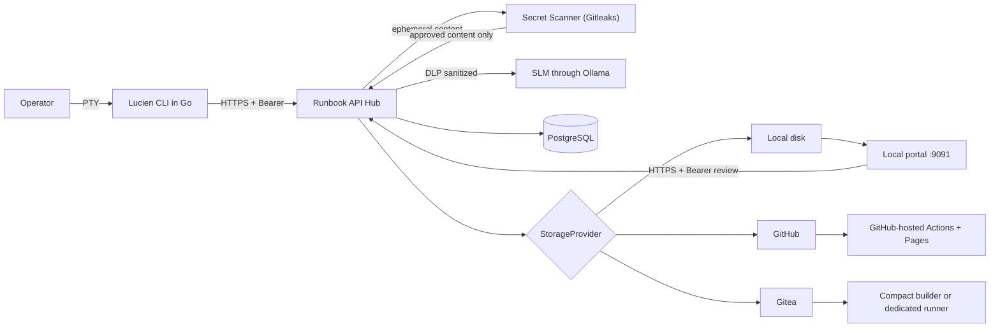
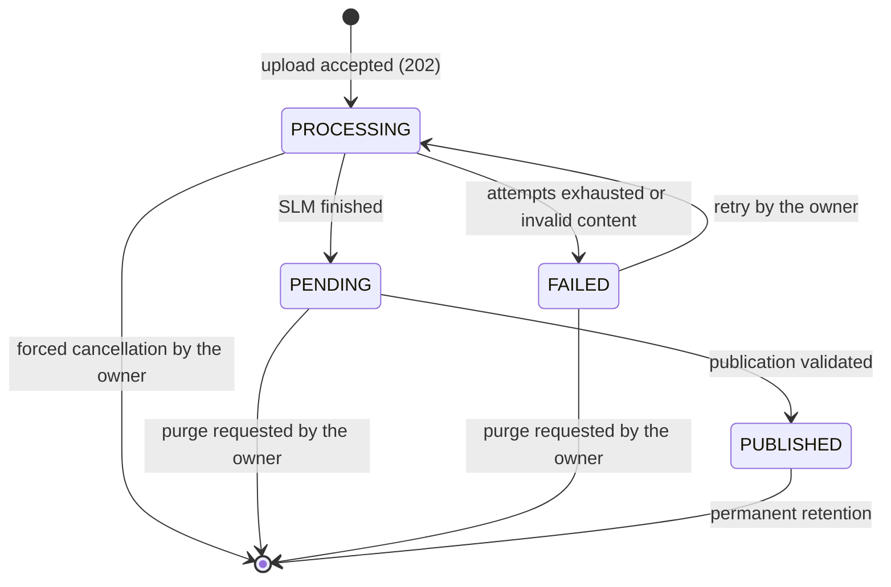

# Technical documentation

## Purpose

Lucien turns a terminal session into a reviewed, publishable runbook. The
ecosystem separates capture, identity, SLM extraction, human review, and
persistence so that none of those stages concentrates excessive authority.

This page is the general technical reference. See also:

- [Usage tutorial](tutorial.md) to run the complete flow;
- [Isolated deployment and TLS](implantacao-isolada.md) to separate the nodes and
  issue certificates;
- [Operation and security](operacao.md) for the runbook grammar;
- [IAM, RBAC, and metadata](iam-rbac.md) for identity and authorization;
- [Wiki publication](publicacao.md) for the local portal, GitHub Pages, or Gitea.

## Architecture



| Component | Responsibility | Must not do |
| --- | --- | --- |
| Lucien CLI | record the PTY, strip ANSI, review commands, and keep the token in the local vault | define role, function, trusted tags, or frontmatter |
| API Hub | authenticate, authorize, sanitize, control jobs, and publish | trust identity or privilege sent by the client |
| SLM | extract commands and suggest tags | execute commands or make RBAC decisions |
| Deterministic enricher | derive tags, prerequisites, impacts, and rollback from a reviewable table | replace extraction or decide authorization |
| PostgreSQL | persist users, jobs, and idempotent reservations | store a token in plain text, or a raw log |
| StorageProvider | publish the validated Markdown | change identity or authorization policy |
| Local portal | authenticate with the Hub, render the read-only volume, and forward authorized revisions | write to the volume, or trust the username/role it was told |
| MkDocs | compile the static documentation | receive secrets or unreviewed content |
| Compact builder | compile a Gitea branch with fixed configuration | run a workflow, hook, plugin, or script from the repository |

## Data flow

1. `lucien start <name> -d "description"` opens a PTY and records the terminal
   locally. The PTY inherits the size of the originating terminal, or 80x24 when
   there is none, and follows `SIGWINCH`. A 0x0 PTY would be propagated by the SSH
   client to the remote equipment, which would then have nothing to render — that
   is what made SSH sessions to OLT, CMTS, and routers look frozen.
2. `lucien stop` ends the capture and preserves state and log locally, without
   depending on authentication or on the Hub being available.
3. `lucien upload` strips ANSI escapes and sends the finished session. The Hub
   returns `202 Accepted` with a `PROCESSING` job; the CLI removes the local copy
   only after that acceptance. If the response is lost, it looks the name up
   before retrying.
4. The Hub validates the token and sends the log and description to the isolated
   Secret Scanner. Detection or unavailability blocks processing (*fail closed*).
5. The DLP sanitizes the approved content. The Hub encrypts the log and the
   description with AES-GCM, bound to owner and name, and writes a durable queue
   in PostgreSQL.
6. A worker acquires a lease with `FOR UPDATE SKIP LOCKED`, queries the SLM, and
   verifies its output again. To compensate for omissions by small models, lines
   with a recognizable prompt supplement the SLM suggestions. Only complete
   commands observed in the log are accepted; fragments, `command not found`
   failures, and capture control commands (`lucien start`, `stop`, and `upload`)
   are discarded. The worker associates each command with its sanitized output: it
   keeps up to the first five lines and, when there is more content, appends `...`
   and the last line. In the same enrichment call, the SLM suggests tags, goal,
   architecture/prerequisites, possible impacts, and rollback in the configured
   language. Those suggestions are non-authoritative, bounded text, and they pass
   through the Secret Scanner and the DLP again. Enrichment is auxiliary:
   `SLM_ENRICHMENT_ENABLED=false` skips the call and, even when enabled, an
   upstream failure records `job.enrichment_skipped` and preserves the extraction
   instead of failing the job — the CLI emits the basic structure and the operator
   writes goal, validation, and rollback during the mandatory review. With
   `RUNBOOK_ENRICHER=deterministic`, enrichment uses no model at all: tags,
   prerequisites, impacts, and rollback come from reviewable tables in
   `app/infrastructure/enrichment.py`, applied to the commands already extracted.
   It reuses the same risk classification as publication validation, covers Linux
   tooling and network platforms (DOCSIS CMTS, GPON OLT, and edge routers), names
   a vendor only when the syntax is distinctive, and never invents a rollback — it
   only inverts symmetric pairs such as `shutdown`/`no shutdown`. The description
   from `lucien start -d`, sanitized, is persisted in the job and fills the Goal
   when there is no SLM suggestion, labeled as operator text. On success, it
   removes the payload and moves the job to `PENDING`; transient failures use
   backoff, and final failures move to `FAILED`. The prompt is recognized in two
   grammars: POSIX, which separates the command with a space
   (`user@host:~$ ls`), and network equipment, which glues the command to the
   prompt (`OLT01>display board 0`, `Router#show run`). Without the second one, no
   SSH session to an OLT, CMTS, or edge router had a command extracted, and the
   whitelist fell back to permissive mode, accepting output lines as commands.
   Full-screen editors and pagers — `nano`, `vi`, `less` — draw the whole screen
   instead of producing linear output. The CLI collapses the alternate-screen
   region (`ESC[?1049h` through `ESC[?1049l`) into a single line saying what
   happened there; without it the output block received nano's menu bar and vi's
   filler lines — 652 and 1679 characters of noise, as measured. The region is
   only collapsed when nothing inside it looks like a command: under `tmux` or
   `screen` the whole session runs on the alternate screen, and collapsing there
   would erase the entire capture. `more` does not use the alternate screen and
   keeps delivering the content that appeared, which there is the real output.
7. `lucien job <id_or_name_or_index>` lets you select commands and edit the
   Markdown. Unchecking a command also removes its output and its associated
   impact. Every command and every suggestion gets a mandatory-review warning
   before the block; Lucien and the SLM never execute those commands. The index
   uses the same ordered list as `lucien reviews`.
8. `lucien job sent <id_or_name_or_index>` publishes with an idempotency key.
9. The Hub applies RBAC, rejects client frontmatter, injects trusted metadata, and
   delegates the write to the configured `StorageProvider`.
10. `lucien runbook revise <uuid>` corrects a publication on any provider. In
    local mode, the portal offers the same flow over the web. The Hub creates a
    new job/artifact and preserves the whole lineage. Unlike the job commands,
    here only the exact UUID is accepted: a wrong index would publish over the
    wrong runbook.

Under `## Objetivo`, the description from `lucien start -d` becomes a `###`
subheading — it is the subject of the runbook, and a heading makes it
recognizable in the wiki index and in the portal listing. The mandatory-review
note comes right below, which is where the operator writes the goal itself.

That is why the grammar accepts a `###` that is not a step heading. The guarantee
that matters stays intact: a ```bash block is only accepted immediately after a
well-formed, sequential `### Passo N: Ação`. A free `###` followed by a command
block is refused, so no command enters the runbook without going through the step
numbering.

The published artifact uses `<clean_name>--<full_uuid>.md`. The clean name
removes only the session suffix generated by the CLI; the trusted UUID stays in
the frontmatter, and the provider refuses any divergent overwrite.

A revision uses the name of the **root** plus `-version-<n>`, not that of the
immediate predecessor — revision 3 is born from 2, and chaining would give
`...-version-2-version-3`:

```text
rotina-seguranca-jump-lucien--06de3bcc-....md              (original)
rotina-seguranca-jump-lucien-version-2--17349111-....md    (revision 2)
rotina-seguranca-jump-lucien-version-3--3f8b02aa-....md    (revision 3)
```

Each revision is still another job with another UUID, and it is the UUID that
guarantees uniqueness on disk — the readable name exists for whoever is looking
for the document.

Revisions published before this format keep the name they were born with
(`revision-<root-uuid>-r<n>`). Nothing needs migrating: the path is derived from
the name recorded in the job row, so every artifact is still found where it is.

When the root name does not work as a filename, the revision falls back to the
UUID scheme. It is not pretty, but it never fails, and a revision must not be
refused because of the source document's name. Every provider organizes the
artifact by the trusted domain frozen by the Hub: on GitHub/Gitea,
`GIT_DOCS_PREFIX/<year>/<domain>/file.md`; on the local destination,
`<year>/<domain>/file.md`.

The year comes before the function because the natural navigation of the
repository is temporal. Publications predating that inversion stay in
`<domain>/<year>/`, and the oldest ones still in `<year>/<month>/`: the artifact
is immutable and the URL may already be written down somewhere else, so nothing
is moved. Only **reading** walks the three generations, current layout first, so
that revising an old runbook keeps working. Writing uses the current layout
exclusively.

The raw log is never persisted. The sanitized log and description exist encrypted
only during processing. In `FAILED` they stay encrypted for retry or explicit
purge; they never enter the runbook or the application logs.

## Job states



`PUBLISHED` is terminal. A published job cannot be changed or deleted through the
API, because that would break the relationship between the audit trail and the
published artifact. Local editing does not change that rule: it creates another
`PENDING` job, linked to the previous one by `supersedes_job_id`, and finishes it
as a new immutable publication.

## REST API

Every route except `/health` and `/ready` requires
`Authorization: Bearer <token>`. The bootstrap accepts only the controlled key;
`/auth/exchange` accepts only a provisional credential. The transport must use
TLS.

| Method | Route | Purpose |
| --- | --- | --- |
| `GET` | `/health` | liveness: the process answers; does not query the database |
| `GET` | `/ready` | readiness: the Hub reaches the database; `503` when it does not |
| `GET` | `/metrics` | operational counters in Prometheus text; admin only |
| `POST` | `/bootstrap/admin` | create the first administrator, exclusively |
| `POST` | `/auth/exchange` | consume a provisional credential and issue the permanent one |
| `GET` | `/me` | validate the token and read the current identity |
| `GET` | `/configuration/runbook` | runbook template language and the domain functions accepted by `-r` |
| `POST` | `/admin/users` | create a user with level and areas, and issue a provisional credential; admin only |
| `POST` | `/admin/users/{id_or_username}/provisional-token` | replace credentials with a provisional one; admin only |
| `PATCH` | `/admin/users/{id_or_username}` | change level, primary area, or additional areas; admin only |
| `DELETE` | `/admin/users/{id_or_username}` | revoke a user; admin only |
| `POST` | `/upload` | sanitize, encrypt, and enqueue a job; returns `202` |
| `GET` | `/jobs/pending` | list the current user's `PENDING` jobs |
| `GET` | `/jobs/active` | list the current user's `PROCESSING`, `PENDING`, and `FAILED` jobs |
| `GET` | `/jobs/{id_or_name}` | get a job belonging to the current user |
| `POST` | `/jobs/{id_or_name}/retry` | requeue one's own `FAILED` job; optional body `{"skip_enrichment": true}` |
| `POST` | `/jobs/{id_or_name}/publish` | publish the reviewed Markdown |
| `DELETE` | `/jobs/{id_or_name}` | purge `PENDING`/`FAILED`; `force=true` also cancels one's own `PROCESSING` |
| `GET` | `/runbooks/published` | list local `PUBLISHED` IDs for the authenticated portal |
| `GET` | `/runbooks/{published_job_id}/content` | get the reviewable body and the `content_hash`; same RBAC as the revision |
| `POST` | `/runbooks/{published_job_id}/revisions` | create a revision; admin or domain senior only |

Upload payload:

```json
{
  "name": "redis-cache-20260720-140000",
  "raw_log": "redis-cli ping",
  "description": "Diagnose latency in the Redis cache",
  "skip_enrichment": false
}
```

`description` is optional and accepts at most 280 characters. `skip_enrichment`
is optional and defaults to `false`; when true, the worker skips the enrichment
call for this job even with `SLM_ENRICHMENT_ENABLED=true`. Extra fields are
rejected. Retry accepts an optional body `{"skip_enrichment": true}`; with no
body, it preserves the choice of the original upload. Publication accepts only
`markdown` and requires the `Idempotency-Key` header with 8 to 128 characters.

The credential exchange also requires `Idempotency-Key`. The Hub derives the
permanent credential from the provisional one and from that key, without storing
it in recoverable form. Repeating the same operation returns the same result;
another key does not reuse the provisional credential.

A revision accepts the same strict payload and also requires
`If-Match: "<sha256-of-the-current-body>"`. The strong hash prevents revising a
version that changed after it was opened. Revisions work on all three providers:
`local`, `github`, and `gitea`. The provider knows how to read and write the
artifact; RBAC, sanitization, secret scanning, frontmatter, and lineage stay in
the Hub and are identical across the three.

`GET /runbooks/{published_job_id}/content` returns the body **without**
frontmatter, plus the `content_hash` to echo in `If-Match`. The omission is
deliberate: the frontmatter is generated server-side and the revision rejects
frontmatter coming from the client, so returning it would only lead the operator
to paste it back and get `400`.

## Identity and Zero Trust

- Permanent and provisional credentials are shown exactly once; only their
  HMAC-SHA-256 values are saved.
- The provisional one expires in four hours and is consumed atomically. In
  PostgreSQL, the row lock guarantees a single logical operation across replicas,
  preserving retries with the same idempotency key.
- Issuing a provisional credential immediately invalidates the previous permanent
  one and replaces any provisional one still pending.
- `AUTH_PEPPER` must live outside the database and hold at least 32 random bytes.
- The Hub looks the user up on every request; revocation takes effect
  immediately.
- The first admin is protected by a persistent latch locked in the same
  transaction as the creation; local application locks are not a source of
  authority.
- Every private or mutating query in the CLI flow includes the `owner_id`
  extracted from the token. The published catalog returns only IDs, and the
  revision applies RBAC by role and by the immutable domain of the root
  publication.
- The CLI keeps tokens in the operating system keyring. The file fallback is
  Unix-only, requires explicit authorization, and uses permission `0600`.
- On a jump server, each operator needs an individual Unix account. The M2M
  credential holds only `jump_enrollment`; the helper hands the provisional
  credential to the CLI over `stdin`, validates that the POSIX ID and the username
  match, and never writes tokens into `.bashrc`, arguments, the environment, or
  logs.
- Role, function, author, and date are never accepted from the publication
  payload. The author's full name is the only partial exception: it arrives in the
  jump server enrollment payload, but it is pure display — no authorization
  decision consults it, and `username` remains the identity.
- The portal grants no authority: `admin` reviews any local runbook and `senior`
  only their own `domain_function`; junior and pleno get `403`. With
  `RBAC_ENTRY_ROLES_ENABLED=true`, junior and pleno start reviewing their own
  domain, and junior starts publishing high criticality.

### Network segmentation

No service reaches the internet by default. The Compose networks are
`internal: true`, and external access exists in three dedicated networks, each
with a single service and separated from the others:

| Network | Service | What for |
| --- | --- | --- |
| `git_egress` | `hub` | publish to GitHub or Gitea |
| `slm_egress` | `slm` | download the model with `ollama pull` |
| `wiki_egress` | `wiki-builder` | clone the wiki repository |

The database, worker, scanner, portal, and static site have no outbound route.
The SLM processes terminal logs from an untrusted origin and therefore does not
share a segment with the database: it lives in `slm_net`, reachable only by the
worker.

Whoever publishes with `STORAGE_PROVIDER=local` can remove `git_egress` from
`hub`, and whoever loads the model into the volume by other means can remove
`slm_egress` from `slm`; in both cases the installation ends up with no outbound
access at all.

`scripts/verify.sh` refuses a change that widens that set: adding an egress
network to an unauthorized service, or creating a new network without marking it
internal, fails the `compose` gate.

## Observability

### Request identifier

Every request gets an identifier that appears in three places: in the response's
`X-Request-Id` header, in the body of error responses (`request_id`), and on every
line of the audit trail for that request. When someone reports a failure, it turns
"around ten o'clock" into an exact search:

```bash
docker compose --env-file .env -f docker-compose.local.yml \
  logs hub | grep '<request_id>'
```

The client may propose its own identifier by sending `X-Request-Id`, to correlate
both sides. The value is untrusted input and is only accepted if it holds 8 to 64
characters of `[A-Za-z0-9._-]`; anything else is discarded and replaced. Without
that, a line break in the header would let a client forge a whole entry in the
trail, and a terminal escape would let it mess with the terminal of whoever read
the log.

The identifier does not exist outside a request: `upload-worker` serves nobody,
and its trail simply does not carry the field.

### Liveness and readiness

`/health` answers that the process is up and does **not** query the database. That
is the one the Compose healthcheck uses, on purpose: restarting the Hub does not
fix a PostgreSQL that is down, and that is exactly what a failed healthcheck
causes.

`/ready` answers whether the Hub can serve right now — it queries the database and
returns `503` when it does not respond. Neither requires a credential, because a
probe carries no token and both only reveal a bit you could already get by trying
to use the Hub.

### Counters

`/metrics` returns text in Prometheus format and requires admin: queue depth and
job volume describe the rhythm of the operation, and there is no scraper in this
installation that would justify leaving them open.

```bash
curl -s --cacert certs/ca.crt -H "Authorization: Bearer $TOKEN" \
  https://localhost:8443/metrics
```

`lucien_upload_queue_idade_maxima_segundos` is the number that exposes a stalled
worker. Depth alone does not distinguish "five arrived just now" from "five stuck
for forty minutes", and the two situations call for opposite reactions.

## Audit trail

Beyond the existing IAM mutations, authenticated issuance records
`user.issue_provisional_token`, the exchange records
`user.exchange_provisional_token`, and local recovery records
`user.recover_provisional_token`. The events contain only identifiers and never
the credential.

Jump server provisioning records `user.jump_enroll` or `user.jump_reissue`;
offline rotation records `service_credential.rotate`. None of those events include
the service credential or the user token.

Identity and job mutations produce structured JSON events in the `lucien.audit`
logger (container stdout, collectable through `docker logs` or the platform log
agent): `user.bootstrap`, `user.create`, `user.update_scopes`, `user.revoke`,
`job.publish`, `job.enrichment_skipped`, `runbook.revise`, and `job.delete`. Each
event records only identifiers, roles, and the publication destination — tokens,
terminal logs, and Markdown never enter the trail.

!!! warning "DLP and secret scanning are distinct controls"
    Gitleaks runs in its own container, with no published port, and receives the
    content only over `stdin`; it returns just `detected: true|false`. The Hub
    fails closed on detection or unavailability. The deterministic DLP still runs
    before the SLM, after the SLM response, and before publication, to replace
    known formats with instructional placeholders. Neither control records the
    analyzed content or the occurrence of the secret.

## Runbook format

The Hub generates the YAML frontmatter using the authenticated `SecurityContext`.
The body must keep each command immediately after its heading:

````markdown
### Step 1: Check the service
```bash
systemctl status redis
```
> Confirm the service is running before continuing.
````

The CLI generates `### Step X: Action`; the Hub also accepts the legacy
`### Passo X: Ação`. That grammar keeps command and intent in the same chunk for
future RAG ingestion. Frontmatter created by hand on the client is rejected.

A revision adds, also server-side, the lineage below. The initial version stays
compatible without those three keys:

```yaml
runbook_raiz: "<id-of-the-first-publication>"
revisao: 2
substitui: "<id-of-the-previous-version>"
```

## Configuration

CLI–Hub communication is defined by environment variables. `.env` makes
development easier, but it is not a production vault.

| Variable | Component | Use |
| --- | --- | --- |
| `API_HOST` | CLI | absolute HTTPS URL of the Hub |
| `TLS_CA_FILE` | CLI | CA used to validate the Hub certificate |
| `DATABASE_URL_FILE` | Hub | file `/run/secrets/database_url` holding the PostgreSQL connection |
| `BOOTSTRAP_API_KEY_FILE` | Hub | file holding the temporary credential of the first admin |
| `AUTH_PEPPER_FILE` | Hub | file holding the secret used when hashing tokens |
| `USER_CREATION_ENABLED` | Hub | opens or closes the bootstrap window |
| `SCANNER_MAX_CONCURRENCY` | secret-scanner | concurrent gitleaks processes. Default `4`; sizing in [Operation](operacao.md) |
| `SCANNER_QUEUE_TIMEOUT_SECONDS` | secret-scanner | maximum wait for a slot before `503`. Default `10` |
| `SLM_NUM_CTX` | upload-worker | SLM context window; `0` returns the runtime default (2048), which truncates the prompt silently. Default `8192` |
| `SLM_PROMPT_MAX_CHARS` | upload-worker | ceiling of the reduced log sent to the SLM. Default `8000`; the calculation is in [Operation](operacao.md) |
| `RUNBOOK_DOMAIN_FUNCTIONS` | Hub and wiki-builder | accepted domain functions, comma-separated; governs `lucien start -r`, user creation, and jump server enrollment. In the builder, it lists in the index the areas that still have no runbook. Default `acessos,servidores,redes,suporte` |
| `RBAC_ENTRY_ROLES_ENABLED` | Hub and portal | `false` (default) keeps junior from publishing high criticality and junior/pleno from reviewing; `true` releases both, with the review restricted to their own domain |
| `SLM_BASE_URL` | upload-worker | private Ollama endpoint |
| `SLM_MODEL` | upload-worker | model used for extraction and reviewable enrichment |
| `SLM_LANGUAGE_RUNBOOK` | Hub and upload-worker | `pt-br` or `en`; language of the template, tags, and SLM suggestions |
| `SLM_TIMEOUT_SECONDS` | upload-worker | timeout of each call; default 300 s |
| `SLM_NUM_THREAD` | upload-worker | SLM threads; `0` detects from the host, ignoring the cgroup quota. Match it to `LUCIEN_SLM_CPU_LIMIT` when the limit is lower than the total CPUs |
| `SLM_ENRICHMENT_ENABLED` | upload-worker | `false` skips the second SLM call; the runbook comes out with the basic structure |
| `RUNBOOK_ENRICHER` | upload-worker | `slm` or `deterministic`; the second enriches from a table, with no model and no external call |
| `UPLOAD_WORKER_POLL_SECONDS` | upload-worker | polling interval on an empty queue |
| `UPLOAD_WORKER_LEASE_SECONDS` | upload-worker | lease; must cover two SLM calls plus 30 s |
| `UPLOAD_WORKER_RETRY_BASE_SECONDS` | upload-worker | base of the exponential backoff, capped at 300 s |
| `UPLOAD_WORKER_MAX_ATTEMPTS` | upload-worker | attempts before marking `FAILED` |
| `MAX_LOG_BYTES` | Hub and CLI | log limit, between 1 KiB and 10 MiB; on reaching it, the CLI truncates the recording and warns at `stop` and at `upload` |
| `SECRET_SCANNER_URL` | Hub | internal URL of the isolated Gitleaks scanner |
| `SECRET_SCANNER_TIMEOUT_SECONDS` | Hub | timeout from 0.1 to 30 s; a failure blocks the content |
| `STORAGE_PROVIDER` | Hub | `local`, `github`, or `gitea` |
| `GIT_API_BASE` | Hub | GitHub API or that of the Gitea installation |
| `GIT_DOCS_PREFIX` | Hub | relative POSIX root, normally `docs/runbooks` |
| `GIT_CA_FILE` | Hub | additional corporate CA mounted in the container; TLS verification is never disabled |
| `VIEWER_SESSION_SECRET_FILE` | local portal | file holding the session key; it is not a user token |
| `WIKI_REPOSITORY_TOKEN_FILE` | compact builder | file holding a separate, read-only Gitea token |
| `EDITOR` | CLI | editor for the review flow; falls back to `vi` |

The installer keeps configuration in `.env` and individual secrets in `secrets/`,
mounted by Docker Compose at `/run/secrets`. That prevents exposure in
`docker inspect`, but it replaces neither Vault/KMS nor protects against root or
access to the Docker socket. The backend keeps the direct variables only for
tests and compatibility; the runtime Compose uses `*_FILE` exclusively.

In non-Swarm Compose, a `file:` source is mounted by bind mount: `uid`, `gid`, and
`mode` from the long syntax are not remapped. That is why the installer uses a
`0700` host directory and `0444` files. The directory keeps other host users away
from the files; the file mode lets non-root processes read only the secrets
explicitly granted to their service.

Every service has CPU/memory limits and reservations. External images are pinned
by digest. Local images get `src-<hash>` and are built with
`docker-compose.build.yml`; the runtime Compose contains no `build:`.

The Compose base values are:

| Class | Main services | Limit | Reservation |
| --- | --- | --- | --- |
| `tiny` | initializers and static Nginx | 0.50 CPU / 256 MiB | 0.05 CPU / 32 MiB |
| `small` | Hub, upload-worker, portal, scanner, `slm-init`, `certgen` | up to 1 CPU / 768 MiB | 0.10 CPU / 128 MiB |
| `medium` | PostgreSQL and wiki-builder | up to 2 CPU / 2 GiB | 0.25 CPU / 256 MiB |
| `slm` | Ollama | up to 4 CPU / 8 GiB | 1 CPU / 2 GiB |

The installer queries `docker info` and writes the CPU limits into `.env`, never
above the total the daemon makes available. On a Docker with 2 CPUs, for example,
`LUCIEN_SLM_CPU_LIMIT=2.00`. Without the installer, the defaults are conservative
at 1 CPU. Size memory and CPU from host metrics and from the chosen model. A limit
that is too low kills the process by OOM or degrades throughput; removing limits
brings back the risk of unavailability from noisy neighbors.

## Publication strategies

- `LocalProvider`: writes to `/<year>/<domain>/<name>--<job_id>.md` using a
  temporary file, `fsync`, and an atomic hard link with no overwrite; divergent
  concurrent content returns a conflict.
- `GitHubProvider`: uses the Contents API and the deterministic path
  `GIT_DOCS_PREFIX/<year>/<domain>/file.md`.
- `GiteaProvider`: reuses the Git strategy, changing `GIT_API_BASE`.

The providers stay prepared simultaneously, but the installer picks a single
operational preset: `local-viewer`, `github`, `gitea-compact`, or `gitea-runner`.
The compact one runs no Actions; the Gitea workflow belongs only to the advanced
mode with a dedicated VM.

## Verifying changes

`scripts/verify.sh` runs every gate the same way CI does, and it exists to be run
**before** copying files to the server — deployment is manual, so a CI that only
fires on push would not protect the moment the change reaches production.

```bash
scripts/verify.sh
```

Each gate is independent: all of them run and the verdict comes at the end. For a
single one, pass the name (`scripts/verify.sh backend`).

## Dependencies

Direct dependencies live in the `pyproject.toml` and `requirements.txt` files,
with exact versions. Transitive ones live in the `*.lock` files, with the hash of
each artifact — `fastapi==0.116.1` drags in starlette, pydantic, anyio, and a
dozen more, and without the lock each build resolved those on the spot.

Builds install with `--require-hashes`: if the bytes of any dependency do not
match the lock, the build fails instead of proceeding with something else.
`setuptools` is in the lock on purpose, because installing the package itself uses
`--no-build-isolation` — otherwise the build backend would be downloaded without
verification in the middle of the process.

To update after touching a direct dependency:

```bash
scripts/update-locks.sh
```

Resolution runs inside the same base image as production. The chosen wheels depend
on the platform and the Python version, so resolving on Windows would produce a
lock that does not describe what runs on the server.

## Known limitations

- The upload is asynchronous and durable. More `upload-worker` replicas consume
  the queue without duplicating leases, but they only increase throughput if the
  SLM also supports concurrency or there are multiple model instances.
- Uploads do not resume partially after a network failure.
- Permanent credentials do not expire automatically; revocation, recovery
  provisional credentials, and a future integration with a short-lived IdP cover
  different risks.
- `LocalProvider` requires a shared volume that preserves POSIX atomic hard-link
  semantics for multiple replicas.
- The Git provider writes directly to the configured branch; mandatory approval
  requires an evolution to branch and Pull Request before marking the job
  published.
- A transport failure with the Git provider (timeout, DNS, TLS, connection
  refused) comes out as `UpstreamError`, never as an internal error: the client
  distinguishes unavailability, which repeating resolves, from a Hub defect. When
  the `PUT` does not answer, the Hub re-reads the destination before giving up —
  the write may have arrived and only the response been lost; identical content
  counts as a publication, different content is a permanent conflict.
- A local revision reserved after a storage failure can be reconciled with the
  same content by another still-authorized actor. Divergent content can only
  replace a `PENDING` reservation after 15 minutes; the new UUID avoids
  overwriting an old I/O. An artifact orphaned by that race stays invisible,
  because the portal cross-references the volume with the Hub's `PUBLISHED`
  catalog.
