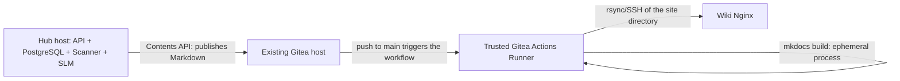

# Wiki publication

The installer keeps four modes ready without mixing their trust boundaries:

| Mode | Hub destination | How the documentation is served |
| --- | --- | --- |
| `local-viewer` | local volume | authenticated portal over HTTPS/9091; reading and revisions through the Hub |
| `github` | GitHub Contents API | GitHub-hosted Actions + GitHub Pages |
| `gitea-compact` | Gitea Contents API | fixed builder + Nginx on the Hub host, no Docker socket |
| `gitea-runner` | Gitea Contents API | Gitea Actions on a dedicated VM + SSH/rsync |

`STORAGE_PROVIDER` is still only `local`, `github`, or `gitea`; the names above
are deployment presets, not new domain providers.

## Local disk and portal with controlled review

The `local-viewer` mode mounts the Hub's own `playbooks-data` volume as read-only
and publishes the portal at `https://<hub-host>:9091`. The interface offers
navigation by function and tags, the look of a documentation site, and a
light/dark toggle. The portal never changes that volume directly.

The form asks for a `username` and the personal Lucien token. The name is only a
UX confirmation: the authority comes from `GET /me` on the Hub. The session keeps
the credential encrypted and authenticated in a `Secure`, `HttpOnly`,
`SameSite=Strict` cookie; the portal revalidates the token with the Hub on every
protected page, so a revocation takes effect on the next request. The token is
not written on the portal server and does not appear in a URL or a log.

Any active Lucien user can read the full local catalog. Roles and functions do
not filter reading in this contract. Only `admin` and `senior` see the edit flow;
a `senior` is restricted to the immutable domain of the root publication, which
must match their current context. The identity of each revision's author is
recorded separately. That hiding is UX only: the Hub repeats the authorization on
every request and never trusts the role or the function in the frontmatter.

An edit sends exclusively the Markdown body to
`POST /runbooks/{published_job_id}/revisions`, with `Idempotency-Key` and a strong
`If-Match` holding the SHA-256 of the opened body. The Hub runs secret scanning,
DLP, grammar, and RBAC, injects the trusted metadata, and writes another file. The
previous document is not overwritten; the new version gets `runbook_raiz`,
`revisao`, and `substitui`, and the portal's stable URL starts showing the highest
published revision.

The form uses CSRF and encrypted/authenticated state. On a transient storage
failure, resend from the same screen: it keeps the key and the content of the
attempt. The same content may also reconcile the reservation through another
still-authorized actor. An attempt with different content gets a conflict while
the reservation is less than 15 minutes old; after that, it creates a successor
with a new UUID. Any file orphaned by the old attempt does not appear in the
portal, because the volume is filtered by the Hub's authenticated catalog of
`PUBLISHED` IDs. A `412` means another revision won the race; reload the runbook
before editing again.

The service reuses the host TLS certificate and trusts the internal CA to call the
Hub over the isolated Docker network. Open TCP/9091 only to reader networks. The
volume stays `:ro`, documents are addressed by UUID, and Markdown/HTML is
sanitized again before rendering.

## Wiki index

The Hub publishes to `<year>/<area>/file.md` and never writes an index: the
repository is content, not navigation. Since MkDocs only produces
`site/index.html` from a `docs/index.md`, the builder generates that file before
compiling, listing the runbooks by year and area.

Without it, MkDocs exits with `0` but produces no `index.html`, and artifact
validation refuses the release. The symptom is misleading: the container stays
`Up` and `unhealthy`, the log repeats `o build não produziu um site válido` every
cycle, and Nginx keeps serving its own default page — nothing indicates that the
cause is a single missing file.

The index is regenerated on every publication, so it follows the content. For a
cover page of your own, add `docs/index.md` to the repository: the builder
recognizes that the file is not its own — by the signature on the first line — and
does not overwrite it.

It opens with an **Areas** section, counting the runbooks in each one. The areas
come from the union of what exists in the repository and what is declared in
`RUNBOOK_DOMAIN_FUNCTIONS` — the same variable the Hub uses, so a single value in
`.env` serves both services.

The union is deliberate in both directions. A newly created area is already
accepted by `lucien start -r` but has no directory yet, so without the declared
list it would be invisible in the wiki until the first publication; it shows up
marked as having no published runbook yet. And an area renamed or removed from
`.env` still has published content, which stays in the index — hiding it would be
worse than showing an area that is off the list.

The variable is optional for the builder. Without it, the index goes back to
discovering everything from disk, and only the empty areas stop appearing. The one
that validates this value seriously is the Hub, which uses it to authorize; the
builder ignores malformed entries instead of stopping publication.

## Review through the CLI, on any provider

The portal covers only `local` mode. To correct a publication on any of the three
providers, the path is `lucien runbook revise <uuid>`: the CLI downloads the body
through `GET /runbooks/{published_job_id}/content`, opens `EDITOR`, and sends the
result to the same `POST /runbooks/{published_job_id}/revisions` the portal uses.

The CLI never talks to Git. If it did, it would bypass secret scanning, DLP,
grammar, RBAC, and server-side frontmatter all at once. Reading and writing the
artifact is the job of the Hub's storage provider, behind those five layers — which
is why the behavior is identical on `local`, `github`, and `gitea`.

The command requires the exact publication UUID, with no index and no name, so the
operator knows exactly which version they are correcting. Usage details are in the
[installation manual](manual-instalacao.md).

## GitHub Pages

The workflow compiles with `mkdocs build --strict`, sanitizes the HTML through the
trusted hook `wiki-builder/app/mkdocs_hook.py`, uploads the `site/` directory as a
Pages artifact, and deploys with minimal permissions. The file already shipped is
`.github/workflows/deploy.yml`; do not use `mkdocs gh-deploy`, since it would
require writing to a publication branch and would widen privileges unnecessarily.

### Configuring GitHub Actions

1. Push to the `main` branch, at minimum, `.github/workflows/deploy.yml`,
   `mkdocs.yml`, `requirements-docs.txt`, `wiki-builder/app/mkdocs_hook.py`, and
   `docs/`. The hook is build code: protect it under the same rules as the
   workflow.
2. Under **Settings → Actions → General**, enable the Actions the repository
   needs. Keep the default `GITHUB_TOKEN` permission read-only; the build job uses
   only `contents: read`; only the deploy job receives `pages: write` and
   `id-token: write`. If the organization restricts Actions, allow the official
   `actions/*` Actions used in the file; all of them are pinned by SHA, not by a
   moving tag.
3. Under **Settings → Pages → Build and deployment → Source**, select
   **GitHub Actions**. For confidential documentation, also confirm
   **Visibility → Private**; that option requires a GitHub Enterprise Cloud
   organization.
4. Open a Pull Request that changes `docs/`, `mkdocs.yml`,
   `requirements-docs.txt`, the hook, or the workflow itself. The PR runs only the
   build; the deploy happens after the merge/push to `main`. It can also be run
   manually under **Actions → Publicar Wiki de Runbooks → Run workflow**, as long
   as the selected branch is `main`.
5. After the first run, open **Settings → Environments → github-pages** and
   restrict the deployment to the `main` branch. If the plan allows it and
   publication time is not critical, add an environment reviewer.
6. Protect `main` under **Settings → Rules → Rulesets** or
   **Settings → Branches**: require a Pull Request, at least one approval, a
   successful `build` job, and block direct pushes, including for changes to the
   workflow and the hook.

The current workflow, intended for **GitHub.com/GitHub Enterprise Cloud**,
requires no custom secret: GitHub supplies the `GITHUB_TOKEN` and the temporary
OIDC identity for Pages. Do not create a Personal Access Token for that deploy.
The Pip cache is managed by `actions/setup-python` and uses
`requirements-docs.txt` as its key.

`actions/deploy-pages@v5` targets GitHub.com and is not declared compatible with
GitHub Enterprise Server (GHES). For GHES, treat the deployment as another mode
and validate a strategy supported by the installed version; do not reuse this
workflow assuming equivalence.

This is different from the Hub credential. For `STORAGE_PROVIDER=github`, create a
separate *fine-grained* token, limited to the private runbooks repository only,
with **Contents: Read and write**, and configure it as `GIT_TOKEN` on the server.
It needs no Actions or Pages permission. Since the current provider writes
directly to `GIT_BRANCH`, a rule blocking every push will require a narrow bypass
for that identity; if policy does not allow a bypass, this provider still needs to
evolve to branch + Pull Request.

!!! danger "A private repository does not mean a private site"
    On GitHub.com, GitHub Pages can build from private repositories on the Pro,
    Team, and Enterprise Cloud plans, but private access control for the **site**
    requires the repository to belong to a GitHub Enterprise Cloud organization.
    Without that feature, the site may stay public on the Internet even though the
    repository is private. For internal runbooks, do not select this mode until
    you have confirmed **Settings → Pages → Visibility → Private**. Actions in
    private repositories also consume the plan's minute allowance.

Private access applies to project sites from private or internal repositories; it
is not offered for organization sites. Users of the private site must have read
access to the repository. See the official rules on [GitHub
plans](https://docs.github.com/en/get-started/learning-about-github/githubs-plans),
[Pages visibility](https://docs.github.com/en/enterprise-cloud@latest/pages/getting-started-with-github-pages/changing-the-visibility-of-your-github-pages-site),
and [HTTPS/default visibility](https://docs.github.com/en/enterprise-cloud@latest/pages/getting-started-with-github-pages/securing-your-github-pages-site-with-https).

Official references: [configuring a publishing source for GitHub
Pages](https://docs.github.com/en/pages/getting-started-with-github-pages/configuring-a-publishing-source-for-your-github-pages-site),
[custom workflows for Pages](https://docs.github.com/en/pages/getting-started-with-github-pages/using-custom-workflows-with-github-pages),
and [security in GitHub Actions](https://docs.github.com/en/actions/reference/security/secure-use).

## Compact Gitea on the Hub host

The `gitea-compact` mode serves small installations without turning the Hub host
into a CI executor. A rootless process periodically polls a single HTTPS branch of
Gitea, compiles `docs/` with a fixed MkDocs configuration from the image, and
promotes the result into a volume shared with a rootless Nginx. The builder does
not mount `/var/run/docker.sock` and does not interpret `.gitea/workflows/`,
`mkdocs.yml`, hooks, plugins, or scripts from the repository.

Use two distinct credentials:

- `secrets/git_token`: minimal write access, used by the Hub to publish Markdown;
- `secrets/wiki_repository_token`: minimal read access, used only by the builder.

Configure `WIKI_REPOSITORY_URL` with the HTTPS clone URL,
`WIKI_REPOSITORY_BRANCH` with the fixed branch, and `GIT_CA_SOURCE` with the
additional public CA when Gitea uses a private PKI. Never put the token in the
clone URL. The installer writes both as Docker Compose secrets; root and access to
the Docker socket must still be controlled.

Each build goes to an immutable release identified by the commit and the version
of the fixed configuration. Reprocessing the same state is idempotent; swapping
the `current` link is atomic, and a Git or MkDocs failure preserves the previous
version. Symbolic links in the repository and content above the configured limits
are rejected.

The compact Nginx is published on `127.0.0.1:9092` by default. Put a corporate TLS
proxy in front before exposing it to the network; do not open HTTP/9092 directly.
The builder needs HTTPS egress only to Gitea and shares no network with
PostgreSQL, the SLM, the scanner, or the Hub.

```sh
docker compose --env-file .env -f docker-compose.local.yml \
  -f docker-compose.build.yml --profile gitea-compact build wiki-builder
docker compose --env-file .env -f docker-compose.local.yml \
  --profile gitea-compact up -d
docker compose --env-file .env -f docker-compose.local.yml \
  logs -f wiki-builder wiki-static
```

This mode requires neither enabling Gitea Actions nor registering a runner.

## Advanced Gitea runner and internal Nginx

MkDocs is not a permanent service and does not need to be installed on the Gitea
machine. The flow has components with different responsibilities:



This is the advanced mode for organizations that already have a VM dedicated to
`act_runner`. Do not install the runner on the Hub host, since workflows execute
repository code and Docker access is equivalent to `root`. It does not need to be
on the Gitea host either.

The Actions Runner runs `mkdocs build --strict` on every push and then exits. Only
Nginx stays running to serve the HTML. The configuration below takes no part in
compact mode.

Enable Actions in Gitea and register a trusted runner that provides Python,
OpenSSH, and rsync. Register these secrets in the repository:

| Secret | Use |
| --- | --- |
| `SERVIDORES_WIKI_HOST` | FQDN or IPv4 of the Nginx server |
| `SERVIDORES_WIKI_USER` | non-root user dedicated to the deploy |
| `SERVIDORES_WIKI_PATH` | root, for example `/srv/www/runbooks` |
| `SSH_PRIVATE_KEY` | dedicated private key with no extra privileges |
| `WIKI_KNOWN_HOSTS` | the host's SSH public key, obtained over a trusted channel |

The deploy user must write only to `SERVIDORES_WIKI_PATH`. The workflow transfers
each build to `releases/<commit>` and swaps the `current` link atomically. Use
`deploy/nginx/lucien-runbooks.conf` as a base to serve
`/srv/www/runbooks/current` exclusively over HTTPS. Adjust FQDN, certificate,
group, and permissions to the distribution; the deploy user must not be `root` and
must not be able to change the Nginx configuration.

### Configuring Gitea Actions

#### 1. Enable Actions on the instance

In Gitea's `app.ini`, configure:

```ini
[actions]
ENABLED = true
DEFAULT_ACTIONS_URL = github
```

Restart only the Gitea service after saving the configuration. With
`DEFAULT_ACTIONS_URL=github`, relative references such as `actions/checkout`
download code from GitHub; the runner needs controlled HTTPS egress to that
destination.

On an isolated network, mirror the `actions/checkout` and `actions/setup-python`
repositories in Gitea, including the commits pinned in the workflow, and then use:

```ini
[actions]
ENABLED = true
DEFAULT_ACTIONS_URL = self
```

Do not replace the workflow's pinned hashes with moving tags such as `@main` or
`@latest`. Check the [official Actions
configuration](https://docs.gitea.com/administration/config-cheat-sheet#actions-actions)
before updating a Gitea version.

#### 2. Enable Actions on the repository

Even with the feature globally enabled, the repository may still have Actions
disabled. Open the repository's **Settings → Units** and check
**Enable Repository Actions**. The exact menu name may vary between versions; the
official guide keeps the flow current at [Gitea Actions Quick
Start](https://docs.gitea.com/usage/actions/quickstart).

#### 3. Install and register an isolated runner

Use a dedicated Linux host with Docker. Running jobs in containers is preferable
to running them directly on the host, but the runner's access to Docker is still a
privilege equivalent to `root`; do not share that host with the Hub, the SLM, the
database, or Gitea.

1. Download a stable, pinned version of `act_runner` from the official releases
   page, validate the available checksum/signature, and confirm with
   `./act_runner --version`.
2. In Gitea, open `/<owner>/<repo>/settings/actions/runners` and generate a
   registration token at the repository level. Avoid an instance runner, which
   would accept jobs from other repositories.
3. Create a service user with no login and register the runner interactively.
   Interactive mode avoids writing the registration token into the shell history
   or the process list.

On the dedicated host, keep `deploy/install-hub.sh` and
`deploy/systemd/act-runner.service` in the same tree and run the guided mode:

```bash
chmod +x deploy/install-hub.sh
./deploy/install-hub.sh --configure-gitea-runner
```

The installer does not download the binary: first pin a version, validate its
checksum, and install it at `/usr/local/bin/act_runner`. If run by a regular user,
the script uses `sudo`; when already `root`, it drops that prefix. Without `sudo`,
the mode stops and requires running directly as `root`. It preserves existing
`config.yaml` and `.runner` files, validates the daemon for at most ten seconds,
and installs the `systemd` unit when that manager is active.

The manual equivalent is:

```bash
sudo useradd --system --home-dir /var/lib/act-runner \
  --create-home --shell /usr/sbin/nologin act-runner
sudo usermod -aG docker act-runner
sudo install -d -o act-runner -g act-runner -m 0700 /var/lib/act-runner
sudo -u act-runner sh -c \
  'cd /var/lib/act-runner && /usr/local/bin/act_runner generate-config > config.yaml'
sudo -u act-runner sh -c \
  'cd /var/lib/act-runner && /usr/local/bin/act_runner --config config.yaml register'
```

Answer the prompts with:

| Field | Recommended value |
| --- | --- |
| Instance URL | `https://gitea.example.internal` |
| Token | the repository registration token |
| Name | `runbooks-mkdocs-01` |
| Labels | `ubuntu-latest:docker://gitea/runner-images:ubuntu-latest` |

Register the daemon with the distribution's service manager. To validate before
creating the `systemd` unit, run it in the foreground:

```bash
sudo -u act-runner sh -c \
  'cd /var/lib/act-runner && /usr/local/bin/act_runner daemon --config config.yaml'
```

Registration creates `.runner`; treat that file as a credential and apply
permission `0600`. For production, run the daemon through `systemd`, with the
dedicated service user, automatic restart, and an immutable version of the job
image, ideally pinned by digest. The example uses the runner image maintained by
the Gitea ecosystem; confirm that it contains Bash, Python, OpenSSH, and rsync.
The workflow itself fails before the deploy if `ssh` or `rsync` is missing.

Installation, label, and registration details are in the official
[`act_runner`](https://docs.gitea.com/usage/actions/act-runner) documentation.

#### 4. Prepare access to Nginx

On the administrative host, generate a dedicated key for the automated deploy:

```bash
chmod +x deploy/install-hub.sh
./deploy/install-hub.sh --prepare-nginx-deploy
```

By default, the guided mode writes the material to `~/.config/lucien/deploy/`,
refuses to create the key inside the repository, preserves an already-complete key
pair, and applies a timeout to `ssh-keyscan`. Comparing the displayed fingerprint
with one obtained over an independent channel is still mandatory.

The manual equivalent is:

```bash
ssh-keygen -t ed25519 -a 100 -N '' \
  -C 'lucien-gitea-actions' \
  -f ./lucien-wiki-deploy
```

Install only `lucien-wiki-deploy.pub` in the `authorized_keys` of the non-root
Nginx user, using the `restrict` option, and limit writing to the publication root
through filesystem permissions. The private key goes only into the
`SSH_PRIVATE_KEY` secret.

Obtain the Nginx SSH public key and validate the fingerprint over a trusted
channel before registering it:

```bash
ssh-keyscan -H wiki.example.internal > wiki_known_hosts
ssh-keygen -lf wiki_known_hosts
```

`ssh-keyscan` alone does not authenticate the server; without the independent
fingerprint check, an attacker could supply their own key.

#### 5. Register the secrets

Under the repository's **Settings → Actions → Secrets**, create exactly the five
secrets from the previous table. Do not use plain variables for sensitive values.
After registering them, securely delete the local copies of the private key and
the registration token that are no longer needed.

#### 6. Protect and test

1. Under **Settings → Branches**, protect `main`: block direct pushes, require a
   Pull Request and at least one approval; administrators must obey the rule too.
2. Push `.gitea/workflows/deploy.yml`, `mkdocs.yml`, `requirements-docs.txt`, and
   `docs/` to `main` through a Pull Request.
3. Under **Actions**, confirm that the job was assigned to `runbooks-mkdocs-01`,
   that `mkdocs build --strict` finished without warnings, and that the server's
   `current` link now points to `releases/<commit>`.
4. Reach the wiki over HTTPS and test a rollback too: point `current` at an
   earlier release using an administrative account on Nginx. The CI user must not
   have permission to change Nginx or to escalate privileges.

The secrets follow the rules described in the [official Gitea Secrets
documentation](https://docs.gitea.com/usage/actions/secrets). Branch protection
configuration lives under **Settings → Branches**.

!!! warning "Environment without Internet"
    Mirror the Actions and the Python packages internally. Do not let a production
    runner execute workflows from untrusted repositories.
