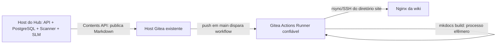

# Publicação da wiki

O instalador mantém quatro modos prontos sem misturar suas fronteiras de
confiança:

| Modo | Destino do Hub | Como a documentação é servida |
| --- | --- | --- |
| `local-viewer` | volume local | portal autenticado em HTTPS/9091; leitura e revisões via Hub |
| `github` | GitHub Contents API | GitHub-hosted Actions + GitHub Pages |
| `gitea-compact` | Gitea Contents API | builder fixo + Nginx no host do Hub, sem Docker socket |
| `gitea-runner` | Gitea Contents API | Gitea Actions em VM dedicada + SSH/rsync |

`STORAGE_PROVIDER` continua sendo apenas `local`, `github` ou `gitea`; os nomes
acima são presets de implantação, não novos providers do domínio.

## Disco local e portal com revisão controlada

O modo `local-viewer` monta o mesmo volume `playbooks-data` do Hub como somente
leitura e publica o portal em `https://<host-do-hub>:9091`. A interface possui
navegação por função e tags, aparência de site de documentação e alternância
claro/escuro. O portal nunca altera esse volume diretamente.

O formulário solicita `username` e o token pessoal do Lucien. O nome é apenas uma
confirmação de UX: a autoridade vem de `GET /me` no Hub. A sessão mantém a
credencial cifrada e autenticada em cookie `Secure`, `HttpOnly` e
`SameSite=Strict`; o portal revalida o token no Hub em cada página protegida, de
modo que uma revogação tem efeito na requisição seguinte. O token não é gravado no
servidor do portal nem aparece em URL ou log.

Qualquer usuário Lucien ativo pode ler o catálogo local completo. Papéis e funções
não filtram leitura neste contrato. Somente `admin` e `senior` veem o fluxo de
edição; um `senior` fica restrito ao domínio imutável da publicação raiz, que
deve coincidir com o seu contexto atual. A identidade do autor de cada revisão é
registrada separadamente. Essa ocultação é apenas UX: o Hub repete a autorização
em toda requisição e nunca confia no papel ou na função do frontmatter.

Uma edição envia exclusivamente o corpo Markdown para
`POST /runbooks/{job_publicado_id}/revisions`, com `Idempotency-Key` e `If-Match`
forte contendo o SHA-256 do corpo aberto. O Hub executa secret scanning, DLP,
gramática e RBAC, injeta os metadados confiáveis e grava outro arquivo. O documento
anterior não é sobrescrito; a nova versão recebe `runbook_raiz`, `revisao` e
`substitui`, e a URL estável do portal passa a mostrar a maior revisão publicada.

O formulário usa CSRF e estado cifrado/autenticado. Em falha transitória de
storage, repita o envio na mesma tela: ela conserva a chave e o conteúdo da
tentativa. O mesmo conteúdo também pode reconciliar a reserva por outro ator
ainda autorizado. Uma tentativa com conteúdo diferente recebe conflito enquanto
a reserva tem menos de 15 minutos; depois disso, ela cria um sucessor com novo
UUID. Um possível arquivo órfão da tentativa antiga não aparece no portal, pois o
volume é filtrado pelo catálogo autenticado de IDs `PUBLISHED` do Hub. Um `412`
significa que outra revisão venceu a corrida; recarregue o runbook antes de editar
novamente.

O serviço reutiliza o certificado TLS do host e confia na CA interna para chamar o
Hub pela rede Docker isolada. Libere TCP/9091 somente para as redes leitoras. O
volume permanece `:ro`, os documentos são endereçados por UUID e Markdown/HTML é
sanitizado novamente antes da renderização.

## Índice da wiki

O Hub publica em `<ano>/<área>/arquivo.md` e nunca escreve um índice: o
repositório é conteúdo, não navegação. Como o MkDocs só produz `site/index.html`
a partir de um `docs/index.md`, o builder gera esse arquivo antes de compilar,
listando os runbooks por ano e área.

Sem isso o MkDocs sai com `0` mas não produz `index.html`, e a validação do
artefato recusa a release. O sintoma é enganoso: o contêiner fica `Up` e
`unhealthy`, o log repete `o build não produziu um site válido` a cada ciclo, e
o Nginx segue servindo a página padrão dele — nada indica que a causa é um único
arquivo ausente.

O índice é regenerado a cada publicação, então acompanha o conteúdo. Para uma
capa própria, adicione `docs/index.md` ao repositório: o builder reconhece que o
arquivo não é dele — pela assinatura na primeira linha — e não o sobrescreve.

Ele abre com uma seção **Áreas**, contando os runbooks de cada uma. As áreas saem
da união entre o que existe no repositório e o que está declarado em
`RUNBOOK_DOMAIN_FUNCTIONS` — a mesma variável do Hub, de modo que um único valor
no `.env` serve os dois serviços.

A união é deliberada nos dois sentidos. Uma área recém-criada já é aceita por
`lucien start -r` mas ainda não tem diretório nenhum, então sem a lista declarada
ela seria invisível na wiki até a primeira publicação; ela aparece marcada como
`nenhum runbook publicado ainda`. E uma área renomeada ou removida do `.env`
continua tendo conteúdo publicado, que segue no índice — escondê-lo seria pior do
que mostrar uma área fora da lista.

A variável é opcional para o builder. Sem ela, o índice volta a descobrir tudo
pelo disco e só as áreas vazias deixam de aparecer. Quem valida esse valor a
sério é o Hub, que o usa para autorizar; o builder ignora entradas malformadas em
vez de parar de publicar.

## Revisão pelo CLI, em qualquer provedor

O portal cobre apenas o modo `local`. Para corrigir uma publicação em qualquer um
dos três provedores, o caminho é `lucien runbook revise <uuid>`: o CLI baixa o
corpo por `GET /runbooks/{job_publicado_id}/content`, abre o `EDITOR` e envia o
resultado ao mesmo `POST /runbooks/{job_publicado_id}/revisions` usado pelo portal.

O CLI nunca fala com o Git. Se falasse, contornaria de uma vez secret scanning,
DLP, gramática, RBAC e frontmatter server-side. Quem lê e grava o artefato é o
provedor de storage do Hub, atrás dessas cinco camadas — por isso o comportamento
é idêntico em `local`, `github` e `gitea`.

O comando exige o UUID exato da publicação, sem índice nem nome, para que o
operador saiba exatamente qual versão está corrigindo. Os detalhes de uso estão
no [manual de instalação](manual-instalacao.md).

## GitHub Pages

O workflow compila com `mkdocs build --strict`, sanitiza o HTML pelo hook confiável
`wiki-builder/app/mkdocs_hook.py`, envia o diretório `site/` como artefato do Pages
e faz o deploy com permissões mínimas. O arquivo já entregue é
`.github/workflows/deploy.yml`; não use `mkdocs gh-deploy`, pois ele exigiria
escrita em uma branch de publicação e ampliaria desnecessariamente os privilégios.

### Configurar GitHub Actions

1. Envie para a branch `main`, no mínimo, `.github/workflows/deploy.yml`,
   `mkdocs.yml`, `requirements-docs.txt`, `wiki-builder/app/mkdocs_hook.py` e
   `docs/`. O hook é código de build: proteja-o pelas mesmas regras do workflow.
2. Em **Settings → Actions → General**, habilite as Actions necessárias ao
   repositório. Mantenha a permissão padrão do `GITHUB_TOKEN` como somente leitura;
   o Job de build usa apenas `contents: read`; somente o Job de deploy recebe
   `pages: write` e `id-token: write`.
   Se a organização restringe Actions, permita as Actions oficiais `actions/*`
   usadas no arquivo; todas estão fixadas por SHA, não por tag móvel.
3. Em **Settings → Pages → Build and deployment → Source**, selecione
   **GitHub Actions**. Para documentação confidencial, confirme também
   **Visibility → Private**; essa opção requer organização GitHub Enterprise Cloud.
4. Abra um Pull Request que altere `docs/`, `mkdocs.yml`,
   `requirements-docs.txt`, o hook ou o próprio workflow. O PR executa somente o
   build; o deploy ocorre depois do merge/push em `main`. Também é possível
   executar manualmente em **Actions → Publicar Wiki de Runbooks → Run workflow**,
   desde que a branch selecionada seja `main`.
5. Depois da primeira execução, abra **Settings → Environments → github-pages** e
   restrinja o deployment à branch `main`. Se o plano permitir e o tempo de
   publicação não for crítico, adicione um aprovador do ambiente.
6. Proteja `main` em **Settings → Rules → Rulesets** ou **Settings → Branches**:
   exija Pull Request, pelo menos uma aprovação, o Job `build` bem-sucedido e
   bloqueie push direto, inclusive para alterações no workflow e no hook.

O workflow atual, destinado ao **GitHub.com/GitHub Enterprise Cloud**, não exige
segredo personalizado: o GitHub fornece o
`GITHUB_TOKEN` e a identidade OIDC temporária para o Pages. Não crie Personal
Access Token para esse deploy. O cache do Pip é gerenciado pelo
`actions/setup-python` e usa `requirements-docs.txt` como chave.

O `actions/deploy-pages@v5` é destinado ao GitHub.com e não está declarado como
compatível com GitHub Enterprise Server (GHES).
Para GHES, trate a implantação como outro modo e valide uma estratégia suportada
pela versão instalada; não reutilize este workflow presumindo equivalência.

Isso é diferente da credencial do Hub. Para `STORAGE_PROVIDER=github`, crie um
token *fine-grained* separado, limitado somente ao repositório privado de
runbooks, com **Contents: Read and write**, e configure-o como `GIT_TOKEN` no
servidor. Ele não precisa de permissão de Actions ou Pages. Como o provider atual
grava diretamente em `GIT_BRANCH`, uma regra que bloqueie todo push exigirá um
bypass estreito para essa identidade; se a política não permitir bypass, este
provider ainda precisa evoluir para branch + Pull Request.

!!! danger "Repositório privado não significa site privado"
    No GitHub.com, GitHub Pages pode compilar a partir de repositórios privados
    nos planos Pro, Team e Enterprise Cloud, mas o controle de acesso privado do **site** exige que o
    repositório pertença a uma organização no GitHub Enterprise Cloud. Sem esse
    recurso, o site pode permanecer público na Internet mesmo que o repositório
    seja privado. Para runbooks internos, não selecione este modo até confirmar
    **Settings → Pages → Visibility → Private**. Actions de repositórios privados
    também consomem a franquia de minutos do plano.

O acesso privado vale para sites de projeto de repositórios privados ou internos;
não é oferecido a sites de organização. Usuários do site privado precisam ter
leitura no repositório. Consulte as regras oficiais sobre [planos do
GitHub](https://docs.github.com/en/get-started/learning-about-github/githubs-plans),
[visibilidade do Pages](https://docs.github.com/en/enterprise-cloud@latest/pages/getting-started-with-github-pages/changing-the-visibility-of-your-github-pages-site)
e [HTTPS/visibilidade padrão](https://docs.github.com/en/enterprise-cloud@latest/pages/getting-started-with-github-pages/securing-your-github-pages-site-with-https).

Referências oficiais: [configurar a fonte de publicação do GitHub
Pages](https://docs.github.com/en/pages/getting-started-with-github-pages/configuring-a-publishing-source-for-your-github-pages-site),
[workflows personalizados do Pages](https://docs.github.com/en/pages/getting-started-with-github-pages/using-custom-workflows-with-github-pages)
e [segurança no GitHub Actions](https://docs.github.com/en/actions/reference/security/secure-use).

## Gitea compacto no host do Hub

O modo `gitea-compact` atende instalações pequenas sem transformar o host do Hub
em executor de CI. Um processo rootless consulta periodicamente uma única branch
HTTPS do Gitea, compila `docs/` com uma configuração MkDocs fixa da imagem e
promove o resultado em um volume compartilhado com um Nginx rootless. O builder
não monta `/var/run/docker.sock` e não interpreta `.gitea/workflows/`,
`mkdocs.yml`, hooks, plugins ou scripts do repositório.

Use duas credenciais distintas:

- `secrets/git_token`: escrita mínima usada pelo Hub para publicar Markdown;
- `secrets/wiki_repository_token`: leitura mínima usada somente pelo builder.

Configure `WIKI_REPOSITORY_URL` com a URL HTTPS de clone,
`WIKI_REPOSITORY_BRANCH` com a branch fixa e `GIT_CA_SOURCE` com a CA pública
adicional quando o Gitea usa PKI privada.
Nunca coloque o token na URL de clone. O instalador grava ambos como Docker
Compose secrets; root e acesso ao socket Docker ainda devem ser controlados.

Cada build vai para uma release imutável identificada pelo commit e pela versão da
configuração fixa. Reprocessar o mesmo estado é idempotente; a troca do link
`current` é atômica e uma falha de Git ou MkDocs preserva a versão anterior. Links
simbólicos no repositório e conteúdo acima dos limites configurados são rejeitados.

O Nginx compacto é publicado em `127.0.0.1:9092` por padrão. Coloque um proxy TLS
corporativo na frente antes de expô-lo à rede; não abra HTTP/9092 diretamente. O
builder precisa de saída HTTPS apenas para o Gitea e não compartilha redes com
PostgreSQL, SLM, scanner ou Hub.

```sh
docker compose --env-file .env -f docker-compose.local.yml \
  -f docker-compose.build.yml --profile gitea-compact build wiki-builder
docker compose --env-file .env -f docker-compose.local.yml \
  --profile gitea-compact up -d
docker compose --env-file .env -f docker-compose.local.yml \
  logs -f wiki-builder wiki-static
```

Este modo não requer habilitar Gitea Actions nem registrar runner.

## Gitea runner avançado e Nginx interno

O MkDocs não é um serviço permanente e não precisa ser instalado na máquina do
Gitea. O fluxo possui componentes com responsabilidades diferentes:



Este é o modo avançado para organizações que já possuem uma VM dedicada ao
`act_runner`. Não instale o runner no host do Hub, pois workflows executam código
do repositório e o acesso ao Docker equivale a `root`. Ele também não precisa
estar no host do Gitea.

O Actions Runner executa `mkdocs build --strict` a cada push e encerra o processo.
Somente o Nginx permanece em execução para servir o HTML. A configuração abaixo
não participa do modo compacto.

Habilite Actions no Gitea e registre um runner confiável que forneça Python,
OpenSSH e rsync. Cadastre estes segredos no repositório:

| Segredo | Uso |
| --- | --- |
| `SERVIDORES_WIKI_HOST` | FQDN ou IPv4 do Nginx |
| `SERVIDORES_WIKI_USER` | usuário não-root exclusivo do deploy |
| `SERVIDORES_WIKI_PATH` | raiz, por exemplo `/srv/www/runbooks` |
| `SSH_PRIVATE_KEY` | chave privada exclusiva e sem privilégios extras |
| `WIKI_KNOWN_HOSTS` | chave pública SSH do host, obtida por canal confiável |

O usuário de deploy deve escrever apenas em `SERVIDORES_WIKI_PATH`. O workflow
transfere cada build para `releases/<commit>` e troca o link `current`
atomicamente. Use `deploy/nginx/lucien-runbooks.conf` como base para servir
`/srv/www/runbooks/current` exclusivamente por HTTPS. Ajuste FQDN, certificado,
grupo e permissões conforme a distribuição; o usuário de deploy não deve ser
`root` nem poder alterar a configuração do Nginx.

### Configurar Gitea Actions

#### 1. Habilitar Actions na instância

No `app.ini` do Gitea, configure:

```ini
[actions]
ENABLED = true
DEFAULT_ACTIONS_URL = github
```

Reinicie somente o serviço do Gitea após salvar a configuração. Com
`DEFAULT_ACTIONS_URL=github`, referências relativas como `actions/checkout`
baixam código do GitHub; o runner precisa de saída HTTPS controlada para esse
destino.

Em rede isolada, espelhe no Gitea os repositórios `actions/checkout` e
`actions/setup-python`, incluindo os commits fixados no workflow, e então use:

```ini
[actions]
ENABLED = true
DEFAULT_ACTIONS_URL = self
```

Não troque os hashes fixos do workflow por tags móveis como `@main` ou
`@latest`. Consulte a [configuração oficial de
Actions](https://docs.gitea.com/administration/config-cheat-sheet#actions-actions)
antes de atualizar uma versão do Gitea.

#### 2. Habilitar Actions no repositório

Mesmo com a funcionalidade global ativa, o repositório pode permanecer com
Actions desabilitadas. Abra **Settings → Units** do repositório e marque
**Enable Repository Actions**. O nome exato do menu pode variar entre versões;
o guia oficial mantém o fluxo atualizado em [Gitea Actions Quick
Start](https://docs.gitea.com/usage/actions/quickstart).

#### 3. Instalar e registrar um runner isolado

Use um host Linux dedicado com Docker. Executar Jobs em contêiner é preferível a
executá-los diretamente no host, mas o acesso do runner ao Docker continua sendo
privilégio equivalente a `root`; não compartilhe esse host com Hub, SLM, banco ou
Gitea.

1. Baixe uma versão estável e fixada do `act_runner` na página oficial de
   releases, valide checksum/assinatura disponível e confirme com
   `./act_runner --version`.
2. No Gitea, abra
   `/<owner>/<repo>/settings/actions/runners` e gere um token de registro no nível
   do repositório. Evite runner de instância, que aceitaria Jobs de outros
   repositórios.
3. Crie um usuário de serviço sem login e registre o runner interativamente. O
   modo interativo evita gravar o token de registro no histórico do shell ou na
   lista de processos:

No host dedicado, preserve `deploy/install-hub.sh` e
`deploy/systemd/act-runner.service` na mesma árvore e execute o modo guiado:

```bash
chmod +x deploy/install-hub.sh
./deploy/install-hub.sh --configure-gitea-runner
```

O instalador não baixa o binário: primeiro fixe uma versão, valide seu checksum e
instale-a em `/usr/local/bin/act_runner`. Se executado por um usuário comum, o
script usa `sudo`; quando já está como `root`, remove esse prefixo. Sem `sudo`, o
modo encerra e exige execução direta como `root`. Ele preserva `config.yaml` e
`.runner` existentes, valida o daemon por no máximo dez segundos e instala a
unidade `systemd` quando esse gerenciador está ativo.

O equivalente manual é:

```bash
sudo useradd --system --home-dir /var/lib/act-runner \
  --create-home --shell /usr/sbin/nologin act-runner
sudo usermod -aG docker act-runner
sudo install -d -o act-runner -g act-runner -m 0700 /var/lib/act-runner
sudo -u act-runner sh -c \
  'cd /var/lib/act-runner && /usr/local/bin/act_runner generate-config > config.yaml'
sudo -u act-runner sh -c \
  'cd /var/lib/act-runner && /usr/local/bin/act_runner --config config.yaml register'
```

Responda aos prompts com:

| Campo | Valor recomendado |
| --- | --- |
| URL da instância | `https://gitea.exemplo.interno` |
| Token | token de registro do repositório |
| Nome | `runbooks-mkdocs-01` |
| Labels | `ubuntu-latest:docker://gitea/runner-images:ubuntu-latest` |

Cadastre o daemon no gerenciador de serviços da distribuição. Para validar antes
de criar a unidade `systemd`, execute em primeiro plano:

```bash
sudo -u act-runner sh -c \
  'cd /var/lib/act-runner && /usr/local/bin/act_runner daemon --config config.yaml'
```

O registro cria `.runner`; trate esse arquivo como credencial e aplique permissão
`0600`. Para produção, execute o daemon por `systemd`, com o usuário de serviço
dedicado, reinício automático e uma versão imutável da imagem de Job, idealmente
fixada por digest. O exemplo usa a imagem de runner mantida pelo ecossistema
Gitea; confirme que ela contém Bash, Python, OpenSSH e rsync. O próprio workflow
falha antes do deploy se `ssh` ou `rsync` não existirem.

Detalhes de instalação, labels e registro estão na documentação oficial do
[`act_runner`](https://docs.gitea.com/usage/actions/act-runner).

#### 4. Preparar o acesso ao Nginx

No host administrativo, gere uma chave exclusiva para o deploy automatizado:

```bash
chmod +x deploy/install-hub.sh
./deploy/install-hub.sh --prepare-nginx-deploy
```

Por padrão, o modo guiado grava o material em
`~/.config/lucien/deploy/`, recusa criar a chave dentro do repositório, preserva
um par de chaves já completo e usa timeout no `ssh-keyscan`. Ainda é obrigatório
comparar o fingerprint exibido com aquele obtido por um canal independente.

O equivalente manual é:

```bash
ssh-keygen -t ed25519 -a 100 -N '' \
  -C 'lucien-gitea-actions' \
  -f ./lucien-wiki-deploy
```

Instale somente `lucien-wiki-deploy.pub` no `authorized_keys` do usuário não-root
do Nginx, usando a opção `restrict`, e limite por permissões de filesystem a
escrita à raiz de publicação. A chave privada irá apenas para o segredo
`SSH_PRIVATE_KEY`.

Obtenha a chave pública SSH do Nginx e valide o fingerprint por um canal confiável
antes de cadastrá-la:

```bash
ssh-keyscan -H wiki.exemplo.interno > wiki_known_hosts
ssh-keygen -lf wiki_known_hosts
```

`ssh-keyscan` sozinho não autentica o servidor; sem a conferência independente do
fingerprint, um invasor poderia fornecer a própria chave.

#### 5. Cadastrar os segredos

Em **Settings → Actions → Secrets** do repositório, crie exatamente os cinco
segredos da tabela anterior. Não use variáveis comuns para valores sensíveis.
Depois de cadastrar, apague com segurança as cópias locais da chave privada e do
token de registro que não forem mais necessárias.

#### 6. Proteger e testar

1. Em **Settings → Branches**, proteja `main`: bloqueie push direto, exija Pull
   Request e pelo menos uma aprovação; administradores também devem obedecer à
   regra.
2. Envie `.gitea/workflows/deploy.yml`, `mkdocs.yml`,
   `requirements-docs.txt` e `docs/` para `main` por Pull Request.
3. Em **Actions**, confirme que o Job foi atribuído a `runbooks-mkdocs-01`, que
   `mkdocs build --strict` terminou sem avisos e que o link `current` do servidor
   passou a apontar para `releases/<commit>`.
4. Acesse a wiki por HTTPS e teste também um rollback: aponte `current` para uma
   release anterior usando uma conta administrativa no Nginx. O usuário de CI não
   deve possuir permissão para alterar o Nginx ou elevar privilégios.

Os segredos seguem as regras descritas na [documentação oficial de Secrets do
Gitea](https://docs.gitea.com/usage/actions/secrets). A configuração de proteção
de branch fica em **Settings → Branches**.

!!! warning "Ambiente sem Internet"
    Espelhe as Actions e os pacotes Python internamente. Não permita que um runner
    de produção execute workflows de repositórios não confiáveis.
